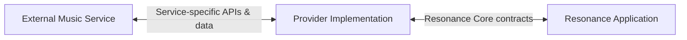
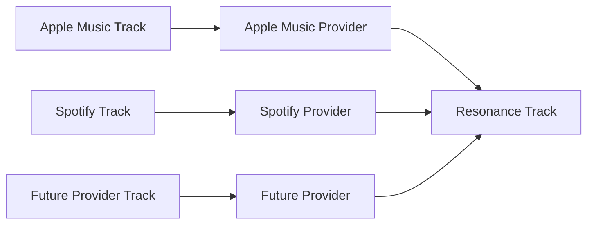
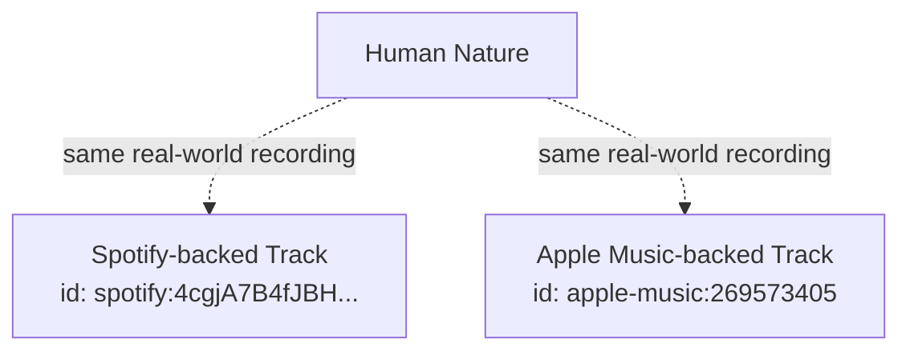
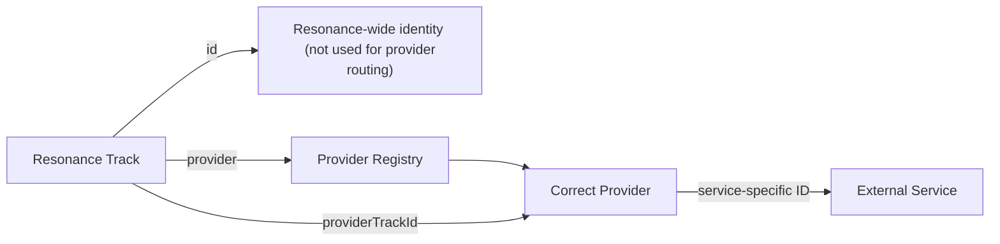
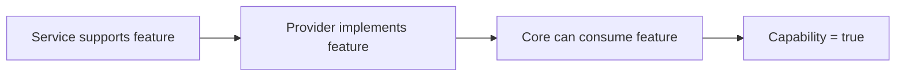
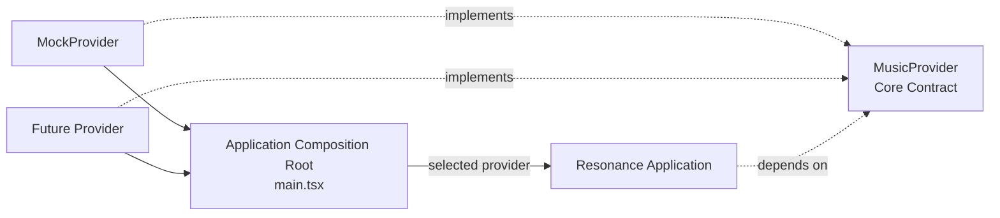

# Provider Architecture

## Overview
Resonance is designed to work with music from different services without coupling the application itself to any one of them. Providers form the boundary between Resonance and external music services, translating service-specific APIs, data models, authentication mechanisms, and playback behaviour into the common contracts defined by Resonance Core.
By using service-specific providers, Resonance can present tracks, playlists, playback states, and content from multiple streaming services through a common data model, without the application having to account for the different API calls and service-specific requirements needed to retrieve that data.
This architecture is also designed to allow content from multiple providers to coexist within Resonance. 
Because provider-backed resources retain information about their originating provider, Resonance can identify which provider is responsible for a resource. This lays the foundation for features such as playlists containing tracks from multiple music services, where playback can be routed to the appropriate provider without exposing those provider transitions to the user.

## The Provider Boundary
Providers act as the boundary between Resonance and the external services it integrates with. Service-specific concerns should, where practical, remain behind this boundary.
This includes service-specific API calls, authentication, response formats, identifiers, playback behaviour, and other implementation details. 

**The provider gets to deal with the bullshit. Resonance gets to be Resonance.**
In practice, this means the rest of the application should not need to know how a service represents a track, performs playback, authenticates a user, or exposes a particular feature. The provider is responsible for translating those service-specific behaviours into the common contracts and models defined by Resonance Core.

Data exposed by a provider should therefore use Resonance's canonical models rather than service-specific types. Similarly, application code should interact with providers through the `MusicProvider` contract, rather than depending directly on concrete implementations.



For example, Spotify and Apple Music may represent tracks differently and require completely different playback APIs. Their respective providers are responsible for handling those differences and exposing them through Resonance's canonical `Track` model and the common `MusicProvider` contract. Application code can then work with those contracts without branching based on the originating service.

## Canonical Resonance Models
Resonance Core defines a set of canonical models used to represent music resources and application state independently of any particular provider. Providers translate the data returned by their respective services into these models before exposing it to the rest of Resonance.

This gives the application a consistent representation of resources even when the underlying services structure their data differently. For example, both Apple Music and Spotify may return different objects for a track, but their providers translate those objects into the same Resonance `Track` model.

The current canonical models include `Track`, `ArtistSummary`, `AlbumSummary`, `Artwork`, and `PlaybackState`. These models contain the information Resonance needs to understand and present those resources without exposing the original provider-specific representation.



Canonical models should represent concepts that are meaningful to Resonance rather than attempting to reproduce every field exposed by every supported service. Provider-specific data should only become part of a Core model when Resonance itself has a provider-independent use for that information.

## Resource Identity
Provider-backed resources have a Resonance-wide `id` in addition to information identifying their originating provider and their provider-local resource ID.
The current convention for Resonance-wide IDs is `provider:resource`.

Let's take a track as an example. If we were to look up Michael Jackson's "Human Nature" on Spotify, we would get the ID `4cgjA7B4fJBHyB9Ya2bu0t`. If we were to look up the same track on Apple Music, we would get the ID `269573405`. 


Resonance currently treats these as distinct provider-backed resources. Determining that resources from different providers represent the same real-world recording is a separate cross-provider entity-resolution problem and is outside the scope of the current identity model. Since Resonance treats these as distinct provider-backed resources, they are also given separate Resonance-wide IDs:

`spotify:4cgjA7B4fJBHyB9Ya2bu0t` and `apple-music:269573405`.


Each provider-backed track therefore stores three pieces of identity information: its Resonance-wide `id`, the `provider` responsible for the resource, and the `providerTrackId` understood by that provider.
```ts
{  
    // Resonance-wide identity for this provider-backed resource.
    id: "spotify:4cgjA7B4fJBHyB9Ya2bu0t"  
    // Identifies the provider responsible for this resource.
    provider: 'spotify'
    // Track identifier understood by the originating provider.
    providerTrackId: '4cgjA7B4fJBHyB9Ya2bu0t' 
}

```

The diagram below demonstrates how these fields allow Resonance to route an operation to the provider responsible for the resource.



## Provider Capabilities
Different music providers do not expose the same functionality, or expose the same functionality in different ways.
Resonance defines a shared `ProviderCapabilities` interface to help inform which features a provider can expose through Resonance.

This keeps application logic provider-independent and avoids scenarios such as:
```ts
if (provider.id === "spotify") {
  // Spotify can do X
}

if (provider.id === "apple-music") {
  // Apple can do Y
}
```

Instead of making assumptions about functionality based on provider identities or their underlying APIs and SDKs, Resonance checks the capabilities advertised by the provider.
```ts
if (provider.capabilities.playback.seek) {
  // Show/use seek functionality
}
```

Capabilities describe functionality implemented by the provider, not the runtime availability of an individual operation. A supported operation may still be unavailable because of authentication state, playback state, resource restrictions, subscription level, or other runtime conditions.

Resonance's Core defines a supported list of features in `ProviderCapabilities`. Each provider implementation declares which of these capabilities it supports. A capability must not be advertised as supported unless its behaviour is implemented by the provider and Resonance Core can consume it.

The existence of a method does not by itself imply capability support. For example, `MockProvider` implements `setShuffle()` and `setRepeatMode()` because they are required by the `MusicProvider` contract. Since the mock provider does not currently implement their actual behaviour, its `shuffle` and `repeat` capabilities remain false.



A capability becomes `true` only when its behaviour is actually implemented by the provider and can be consumed by Resonance.

Related capabilities may be grouped when a feature area contains multiple distinct operations. For example, playback contains separate capabilities for `playTrack`, `resume`, `pause`, `seek`, and other playback operations. Other capabilities such as `search`, `lyrics`, and `recommendations` are currently represented directly as booleans. 

```
ProviderCapabilities
├── playback
│   ├── playTrack
│   ├── resume
│   ├── pause
│   ├── seek
│   ├── ...
│
├── search
├── library
├── playlists
├── queue
├── lyrics
├── recommendations
└── favorites
```

For grouped capabilities, application code should check the specific operation it intends to expose rather than treating the group itself as a single supported/unsupported feature.
```ts
if (provider.capabilities.playback.seek) {
    // Seeking can be exposed by the application.
}
```

The complete capability definitions are available in `packages/core/src/provider/ProviderCapabilities.ts`. 

## Application Composition
Concrete provider implementations are instantiated and registered at the application boundary. In the desktop application, this currently happens in `main.tsx`, which acts as the application's composition root.

Keeping provider construction at the application boundary prevents concrete provider dependencies from spreading throughout the application. Once a provider has been registered and selected, the rest of the application interacts with it through the common `MusicProvider` contract.

To make a provider available to the desktop application, import and register it in `main.tsx`
```tsx
// apps/desktop/src/main.tsx
import { ProviderRegistry } from '@resonance/core';
import { MockProvider } from '@resonance/provider-mock';
import { NewProvider } from '@resonance/provider-new';

const registry = new ProviderRegistry();

registry.register(new MockProvider());
registry.register(new NewProvider());

const activeProvider = registry.get('provider-new');
```

The selected provider is then exposed to the React application using `MusicProviderProvider`.

```tsx
<MusicProviderProvider provider={activeProvider}>
  <App />
</MusicProviderProvider>
```

The current Desktop proof of concept selects a single active provider and exposes it to the React application through `MusicProviderProvider`. More advanced provider selection and routing may be introduced as the application develops, but concrete provider implementations should remain confined to the composition boundary.



Concrete provider packages should generally only be imported where the application is being composed. Application components should depend on Core contracts rather than importing provider implementations directly.

## Implementing a Provider
New provider implementations should depend on `@resonance/core` and implement the common `MusicProvider` contract. A provider is responsible for adapting its service's APIs, authentication, data models, and behaviour to the provider-independent interfaces understood by Resonance.

```ts
import type {
    MusicProvider,
    ProviderCapabilities,
} from '@resonance/core';

export class MyProvider implements MusicProvider {
    readonly id = 'my-provider';
    readonly name = 'My Provider';

    readonly capabilities: ProviderCapabilities = {
        // ...
    };

    // MusicProvider implementation...
}
```

There are a few rules you should follow when implementing a provider:

- Keep service-specific API types and behaviour inside the provider package.
- Translate service resources into canonical Resonance models before returning them to application code.
- Preserve both Resonance-wide and provider-local resource identity.
- Implement operations using provider-local resource IDs where required by the Core contract.
- Advertise a capability as `true` only when its behaviour is actually implemented and consumable by Resonance.
- Do not add provider-specific branches to application code when the distinction can be expressed through capabilities.
- Keep authentication and service-specific configuration behind the provider boundary where practical.
- Register concrete providers at the application composition boundary rather than importing them throughout the application.

`packages/provider-mock` should be used as the reference implementation when creating a new provider. It demonstrates the expected Core integration, canonical resource mapping, playback-state handling, capability declarations, and provider-local resource identity without depending on an external service.

Provider implementations should not blindly copy MockProvider behaviour where the underlying service differs. The mock provider demonstrates the architecture, not the requirements of every music service.

A general starting structure for a new provider package could look like this:
````
packages/
└── provider-my-service/
    ├── src/
    │   ├── MyServiceProvider.ts
    │   └── index.ts
    ├── package.json
    └── tsconfig.json
````

Providers may introduce additional internal modules as required by their service, such as modules for authentication, API communication, or resource mapping. These implementation details should remain internal to the provider package.

The guiding principle when implementing a provider is:
<b>A provider should translate the service into Resonance; Resonance should not adapt itself to the service.</b>

Before implementing a new provider, review the current definitions in `packages/core/src/provider` and the reference implementation in `packages/provider-mock`. Core contracts are the source of truth for what a provider can expose to Resonance.