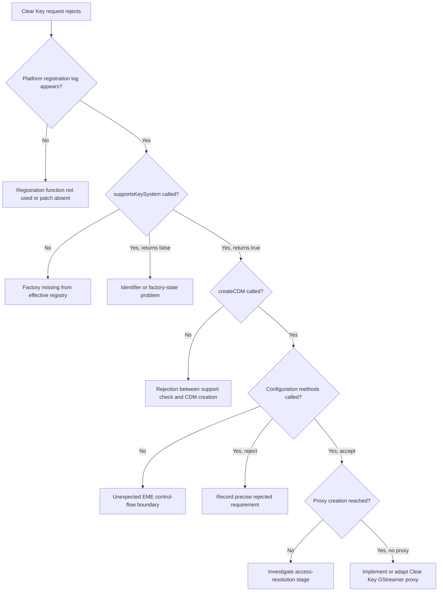

# WebKitGTK EME Build 2: Clear Key Factory Registration

## Status

This document records the second experimental Fedora WebKitGTK build made for
Resonance. It continues the first enablement experiment documented in
[`webkitgtk_enable_eme_build.md`](./webkitgtk_enable_eme_build.md).

The first build (`eme1`) established that Fedora's WebKitGTK 4.1 package had
been compiled without Encrypted Media Extensions (EME). Rebuilding WebKitGTK
2.52.4 with EME enabled exposed `navigator.requestMediaKeySystemAccess` in
Resonance, but no key system was recognized because the GStreamer port only
registered a CDM factory when Thunder was enabled.

The second build (`eme2`) attempted the smallest possible follow-up change:
keep Thunder disabled and explicitly register WebKit's built-in Clear Key CDM
factory on the GStreamer port.

The build and RPM installation succeeded. Resonance was proven to load the
`eme2` WebKitGTK and JavaScriptCore libraries. The EME API remained available,
but every tested Clear Key configuration still rejected with
`NotSupportedError`. This includes configurations that explicitly prohibit
distinctive identifiers and persistent state.

The present result is therefore:

> Registering `CDMFactoryClearKey` in `CDMFactoryGStreamer.cpp` did not, by
> itself, make `org.w3.clearkey` observable through
> `navigator.requestMediaKeySystemAccess()` in the tested WebKitGTK 2.52.4
> runtime.

The exact runtime rejection point has not yet been identified. An instrumented
build is the most defensible next experiment.

## Relationship to the First Build

The first build used the following WebKitGTK 4.1 configuration:

```text
-DENABLE_ENCRYPTED_MEDIA=ON
-DENABLE_THUNDER=OFF
```

That changed the Linux result from:

```text
EME API: Unavailable
```

to:

```text
Secure context: Yes
EME API: Available
```

However, all commercial key systems and Clear Key rejected. Source inspection
then found the following GStreamer-specific registration logic:

```cpp
void CDMFactory::platformRegisterFactories(Vector<WeakRef<CDMFactory>>& factories)
{
#if ENABLE(THUNDER)
    factories.append(CDMFactoryThunder::singleton());
#else
    UNUSED_PARAM(factories);
#endif
}
```

With `ENABLE_THUNDER=OFF`, the factory vector remained empty even though the
generic Clear Key implementation was present in the WebKit source tree. Build
2 tested whether explicitly appending that implementation was sufficient.

## Environment

The second experiment used the same environment as the first:

- Bazzite 44 / Fedora 44 base;
- x86-64;
- Wayland session;
- Fedora 44 Distrobox named `webkit-eme-research`;
- WebKitGTK source version 2.52.4;
- eight parallel build jobs; and
- Resonance running in Tauri development mode with the Linux compositing
  workaround.

The principal research workspace remained:

```text
~/Documents/webkit-eme-research
```

The RPM top directory was:

```text
~/Documents/webkit-eme-research/rpmbuild
```

## Experimental Patch

The final patch was saved as:

```text
~/Documents/webkit-eme-research/rpmbuild/SOURCES/webkitgtk-register-clearkey.patch
```

The complete functional change was:

```diff
--- a/Source/WebCore/platform/graphics/gstreamer/eme/CDMFactoryGStreamer.cpp
+++ b/Source/WebCore/platform/graphics/gstreamer/eme/CDMFactoryGStreamer.cpp
@@ -28,6 +28,7 @@
 
 #include "config.h"
 #include "CDMFactory.h"
+#include "platform/encryptedmedia/clearkey/CDMClearKey.h"
 
 #if ENABLE(ENCRYPTED_MEDIA)
 
@@ -41,10 +42,10 @@
 
 void CDMFactory::platformRegisterFactories(Vector<WeakRef<CDMFactory>>& factories)
 {
+    factories.append(CDMFactoryClearKey::singleton());
+
 #if ENABLE(THUNDER)
     factories.append(CDMFactoryThunder::singleton());
-#else
-    UNUSED_PARAM(factories);
 #endif
 }
```

This patch modified the high-level CDM factory registry. It did not add a Clear
Key implementation to the separate GStreamer `CDMProxyFactory` registry.

## Patch Preparation and the Failed Initial Attempt

The first attempt at build 2 failed. Subsequent inspection revealed that the
factory append line was absent from both the saved patch and the prepared
working copy. The relevant desired line was:

```cpp
factories.append(CDMFactoryClearKey::singleton());
```

The original source tree had already been removed by RPM cleanup, and only a
prepared source file remained at:

```text
~/Documents/webkit-eme-research/rpmbuild/BUILD/
  webkitgtk-2.52.4-build/webkitgtk-2.52.4/
  Source/WebCore/platform/graphics/gstreamer/eme/CDMFactoryGStreamer.cpp
```

The source was corrected, the patch was regenerated, and its contents were
verified to contain both the include and append lines before the full build was
started again.

An incremental check then succeeded, demonstrating that the corrected source
compiled. Because the initial failed build could not be trusted as an `eme2`
result, the RPM release was rebuilt in full after regenerating the patch.

## Spec Configuration

The experimental spec declared the patch as follows:

```spec
# Resonance experiment: register WebKit's built in Clear Key CDM on GStreamer
Patch1000:      webkitgtk-register-clearkey.patch
```

Its preparation section used:

```spec
%prep
%{gpgverify} --keyring='%{SOURCE2}' --signature='%{SOURCE1}' --data='%{SOURCE0}'
%autosetup -p1 -n webkitgtk-%{version}
```

`%autosetup` applies all declared patches, including `Patch1000`, to the shared
source tree before either API variant is configured.

The WebKitGTK 4.1 configuration remained:

```spec
mkdir webkit2gtk-4.1
pushd webkit2gtk-4.1
%cmake -S .. \
  -GNinja \
  -DPORT=GTK \
  -DCMAKE_BUILD_TYPE=Release \
  -DUSE_GTK4=OFF \
  -DUSE_LIBBACKTRACE=OFF \
  -DENABLE_WEBDRIVER=OFF \
  -DENABLE_ENCRYPTED_MEDIA=ON \
  -DENABLE_THUNDER=OFF \
```

The spec builds WebKitGTK 6.0 and WebKitGTK 4.1 in separate build directories,
but both CMake configurations use the same patched source directory through
`-S ..`. Resonance uses the 4.1 variant.

## Compilation Evidence and Unified Sources

The full build completed successfully and produced the expected `eme2`
packages. The log ended with entries including:

```text
Wrote: .../RPMS/x86_64/javascriptcoregtk4.1-2.52.4-1.eme2.fc44.x86_64.rpm
Wrote: .../RPMS/x86_64/webkit2gtk4.1-2.52.4-1.eme2.fc44.x86_64.rpm
Wrote: .../RPMS/x86_64/webkit2gtk4.1-devel-2.52.4-1.eme2.fc44.x86_64.rpm
Wrote: .../RPMS/x86_64/webkit2gtk4.1-debuginfo-2.52.4-1.eme2.fc44.x86_64.rpm
```

RPM then removed the temporary build tree as part of its successful cleanup:

```text
+ rm -rf /home/crato/Documents/webkit-eme-research/rpmbuild/BUILD/
  webkitgtk-2.52.4-build
```

This explains why later attempts to inspect the completed `BUILD` directory
returned no files.

A later search of the verbose compiler log did not contain the literal source
filename `CDMFactoryGStreamer.cpp`. This does not prove the file was omitted.
WebKit compiles large groups of implementation files through generated unified
translation units named `UnifiedSource-*.cpp`; the individual included source
filename therefore does not necessarily appear in the final compiler command.

The compilation log did confirm that both build variants were configured and
built from the common source tree:

```text
+ mkdir webkitgtk-6.0
+ pushd webkitgtk-6.0
...
+ mkdir webkit2gtk-4.1
+ pushd webkit2gtk-4.1
```

and:

```text
+ /usr/bin/cmake --build redhat-linux-build -j8 --verbose
```

## Package Installation

The first installation attempt upgraded only the two runtime packages. DNF
correctly rejected that partial transaction because the installed `eme1`
development packages required exact `eme1` runtime versions:

```text
installed package webkit2gtk4.1-devel-2.52.4-1.eme1.fc44.x86_64
requires javascriptcoregtk4.1(x86-64) = 2.52.4-1.eme1.fc44
```

and:

```text
cannot install both javascriptcoregtk4.1-2.52.4-1.eme2.fc44.x86_64
and javascriptcoregtk4.1-2.52.4-1.eme1.fc44.x86_64
```

The complete matching set was then installed together:

```text
javascriptcoregtk4.1-2.52.4-1.eme2.fc44.x86_64
javascriptcoregtk4.1-devel-2.52.4-1.eme2.fc44.x86_64
webkit2gtk4.1-2.52.4-1.eme2.fc44.x86_64
webkit2gtk4.1-devel-2.52.4-1.eme2.fc44.x86_64
```

DNF reported:

```text
Transaction Summary:
 Upgrading:          4 packages
 Replacing:          4 packages
```

The final package query confirmed that all four relevant packages used the
same `eme2` release:

```text
javascriptcoregtk4.1-2.52.4-1.eme2.fc44.x86_64
javascriptcoregtk4.1-devel-2.52.4-1.eme2.fc44.x86_64
webkit2gtk4.1-2.52.4-1.eme2.fc44.x86_64
webkit2gtk4.1-devel-2.52.4-1.eme2.fc44.x86_64
```

## Runtime Linkage Verification

Resonance was run inside the same Distrobox with:

```sh
WEBKIT_DISABLE_COMPOSITING_MODE=1 \
  pnpm --filter @resonance/desktop tauri dev
```

The application reported:

```text
WebKitGTK encrypted media enabled: true
```

The executable's dynamic dependencies were inspected directly:

```text
libwebkit2gtk-4.1.so.0 => /lib64/libwebkit2gtk-4.1.so.0
libjavascriptcoregtk-4.1.so.0 => /lib64/libjavascriptcoregtk-4.1.so.0
```

RPM ownership then tied both libraries to `eme2`:

```text
$ rpm -qf /lib64/libwebkit2gtk-4.1.so.0
webkit2gtk4.1-2.52.4-1.eme2.fc44.x86_64

$ rpm -qf /lib64/libjavascriptcoregtk-4.1.so.0
javascriptcoregtk4.1-2.52.4-1.eme2.fc44.x86_64
```

This rules out the principal package-selection hypothesis: Resonance was not
silently loading Fedora's original library or the previous `eme1` build.

The terminal continued to show MESA EGL/DRI warnings caused by the container's
graphics path. These warnings were already present when EME became available
under `eme1` and did not prevent the JavaScript probe from executing. They are
not currently considered an explanation for Clear Key negotiation failure.

## Runtime Result

The compatibility probe continued to report:

```text
Secure context: Yes
EME API: Available
Origin: http://localhost:1420
```

However, the Clear Key entry still reported:

```text
No tested configuration recognized
NotSupportedError: The operation is not supported.
```

The commercial key systems remained unrecognized as expected because no
Widevine, FairPlay, or PlayReady CDM had been installed.

## Clear Key Tests

### Empty configuration

The minimal key-system-only request was tested:

```js
navigator.requestMediaKeySystemAccess("org.w3.clearkey", [{}])
```

It rejected:

```text
REJECTED: NotSupportedError: The operation is not supported.
```

### `keyids`, AAC, and CENC

A more explicit configuration was also tested with:

- `initDataTypes: ["keyids"]`;
- `audio/mp4; codecs="mp4a.40.2"`; and
- `encryptionScheme: "cenc"`.

It also rejected with `NotSupportedError`.

### Explicitly prohibited identifier and persistence features

Source inspection suggested that an omitted `distinctiveIdentifier` or
`persistentState` defaults to `optional`, which Clear Key rejects when the
runtime restrictions deny the corresponding feature. To remove that variable,
two additional tests explicitly requested:

```js
distinctiveIdentifier: "not-allowed"
persistentState: "not-allowed"
sessionTypes: ["temporary"]
```

The first test supplied only those requirements. The second also supplied the
`keyids`, AAC, and CENC capability. Both failed.

This rules out omitted optional identifier or persistent-state requirements as
the explanation for the current rejection.

## Source Trace Findings

The installed library contains the literal identifier:

```text
org.w3.clearkey
```

This confirms that Clear Key-related code or data exists in the binary, but it
does not prove that the patched registration call exists or executes. The
generic Clear Key source was already included when EME was enabled in `eme1`.

### High-level factory registration

`CDM::supportsKeySystem()` iterates the registered high-level factories:

```cpp
for (auto& weakFactory : CDMFactory::registeredFactories()) {
    if (Ref { weakFactory.get() }->supportsKeySystem(keySystem))
        return true;
}
```

The factory registry calls the platform-specific function once:

```cpp
std::call_once(once, [&] {
    platformRegisterFactories(factories);
});
```

The patched call is intended to put `CDMFactoryClearKey::singleton()` into
that vector.

### Clear Key support declaration

The built-in factory supports only the expected identifier:

```cpp
bool CDMFactoryClearKey::supportsKeySystem(const String& keySystem)
{
    return equalLettersIgnoringASCIICase(keySystem, "org.w3.clearkey"_s);
}
```

Its supported initialization-data types are:

```text
keyids
cenc
webm
```

Its general configuration check rejects only incompatible identifier and
persistence requirements, and otherwise returns true. It supports temporary
and persistent-license session types and only the empty robustness string.

### GStreamer media-engine gate

WebKitGTK 2.52.4 contains an explicit Clear Key check in the GStreamer media
engine:

```cpp
#if ENABLE(ENCRYPTED_MEDIA)
    result = GStreamerEMEUtilities::isClearKeyKeySystem(keySystem);
#endif
```

`GStreamerEMEUtilities::isClearKeyKeySystem()` compares against
`org.w3.clearkey`. The ordinary GStreamer media-engine identifier gate is
therefore not presently the leading explanation.

### Separate CDM proxy registry

The source trace confirmed a second registry:

```cpp
Vector<CDMProxyFactory*> CDMProxyFactory::platformRegisterFactories()
{
    Vector<CDMProxyFactory*> factories;
#if ENABLE(THUNDER)
    factories.reserveInitialCapacity(1);
    factories.append(&CDMFactoryThunder::singleton());
#endif
    return factories;
}
```

With Thunder disabled, this proxy registry is empty. Furthermore,
`CDMInstanceClearKey` derives from `CDMInstanceProxy`, whose constructor calls:

```cpp
m_cdmProxy = CDMProxyFactory::createCDMProxyForKeySystem(keySystem);
```

On GStreamer, the proxy creation function asserts that a proxy was created.
This is likely to become a later obstacle when creating `MediaKeys` or trying
to decrypt media.

It is not currently considered sufficient to explain the observed
`requestMediaKeySystemAccess()` rejection. That request performs key-system
and configuration negotiation before a `CDMInstanceClearKey` is created.

## Symbol Inspection Limitations

The following searches returned no symbol:

```sh
nm -D -C /lib64/libwebkit2gtk-4.1.so.0 |
  grep 'CDMFactory::platformRegisterFactories'
```

and:

```sh
objdump -T -C /lib64/libwebkit2gtk-4.1.so.0 |
  grep 'CDMFactoryClearKey::singleton'
```

These commands inspect exported dynamic symbols. WebCore's internal symbols
are hidden and the packaged runtime is stripped, so empty output neither
proves nor disproves that the registration call exists in the installed
machine code.

An attempted check for `/lib64/libwebkitgtk-6.0.so.4` also failed because that
library was not installed in the tested environment. This is not relevant to
Resonance, which links against WebKitGTK 4.1.

## Confirmed Findings

1. The `eme2` RPM build completed and produced the expected 4.1 runtime,
   development, debuginfo, and debugsource packages.
2. All four matching WebKitGTK 4.1 and JavaScriptCore 4.1 runtime/development
   packages were upgraded to `2.52.4-1.eme2.fc44`.
3. Resonance's executable resolved the installed `eme2` WebKitGTK and
   JavaScriptCore libraries.
4. The EME JavaScript API remained available.
5. Clear Key still rejected an empty configuration.
6. Clear Key still rejected a `keyids` + AAC + CENC configuration.
7. Clear Key still rejected configurations explicitly setting distinctive
   identifiers and persistent state to `not-allowed`.
8. WebKit's source-level Clear Key implementation appears capable of accepting
   these configurations if its factory is reached.
9. GStreamer recognizes the Clear Key key-system identifier at the media-engine
   support layer when EME is enabled.
10. The separate GStreamer CDM proxy registry remains empty with Thunder
    disabled and will require investigation before actual playback can work.

## What the Experiment Rules Out

The evidence currently rules out:

- EME being absent from the `eme2` build;
- Resonance loading Fedora's original WebKitGTK runtime;
- Resonance loading the previous `eme1` runtime;
- an AAC capability alone causing the failure, because `[{}]` also rejects;
- `keyids` alone causing the failure;
- omitted `distinctiveIdentifier` and `persistentState` defaults being the sole
  cause; and
- the GStreamer media engine simply lacking the Clear Key identifier.

It does **not** yet prove:

- that the patched `platformRegisterFactories()` machine code exists in the
  installed library;
- that `platformRegisterFactories()` executes in the process handling the EME
  request;
- that `CDMFactoryClearKey::supportsKeySystem()` is reached;
- that `CDMFactoryClearKey::createCDM()` is reached; or
- that the empty proxy registry affects access negotiation rather than only
  later `MediaKeys` creation and playback.

## Current Working Hypotheses

The hypotheses are listed in present order of usefulness, not certainty:

1. **The patched factory registration is not executing in the relevant
   process.** The spec and source patch look correct, but no runtime trace has
   yet demonstrated execution.
2. **The compiled 4.1 unified source did not contain the expected patched
   fragment.** This is less likely after confirming `%autosetup` and the shared
   source tree, but the cleaned build tree prevents direct retrospective
   inspection.
3. **A platform policy or earlier WebKit EME gate rejects the identifier before
   the patched factory is consulted.** Source-level tracing or logging is
   needed to identify such a gate.
4. **The empty GStreamer CDM proxy registry is involved earlier than currently
   inferred.** The visible call flow suggests it is a later boundary, so this
   should not be assumed without runtime evidence.

## Recommended Next Experiment

The next build should prioritize observation rather than adding more
functionality. Add unmistakable terminal logging to these points:

1. `CDMFactory::platformRegisterFactories()`;
2. `CDMFactoryClearKey::supportsKeySystem()`;
3. `CDMFactoryClearKey::createCDM()`;
4. `CDMPrivateClearKey::supportsConfiguration()`;
5. `CDMPrivateClearKey::supportsConfigurationWithRestrictions()`; and
6. only if negotiation reaches it,
   `CDMProxyFactory::createCDMProxyForKeySystem()`.

The log should identify the process ID and relevant key-system/configuration
values. A fresh RPM release such as `eme3` should then be installed as a
complete matching package set, and the exact minimal Clear Key requests from
this report should be repeated.

This approach will distinguish among:



No further blind change to the proxy or decryptor path should be made until
the runtime trace establishes how far the current request travels.

## Research Artifacts

The following external artifacts were used during this investigation:

```text
compile-2.log
compile-2-incremental_check.log
compile-2-full.log
postbuild2cmd.txt
clearkey-build2-source-trace.txt
eme2-spec-application-check.txt
eme2-factory-compilation-check.txt
respostb2clin.png
```

The large compiler-log search artifact contains extensive context because its
search expression also matched every `webkit2gtk-4.1` and `webkitgtk-6.0`
build path. It remains useful as evidence of the two configured build trees,
but the absence of the literal `CDMFactoryGStreamer.cpp` filename must not be
misinterpreted due to WebKit's unified-source build system.
