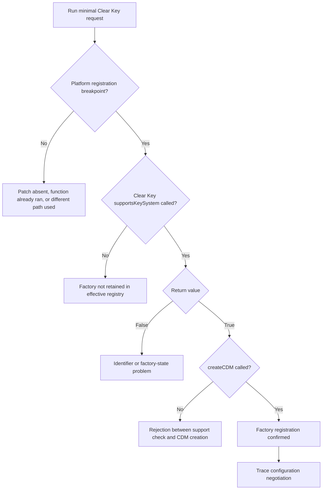

# WebKitGTK EME Runtime Debugging

## Purpose

This document records the current runtime-debugging state of Resonance's Linux
Encrypted Media Extensions investigation. It is a continuation of:

- [`webkit_eme.md`](./webkit_eme.md), which describes EME and the initial
  cross-platform investigation;
- [`webkitgtk_investigation.md`](./webkitgtk_investigation.md), which examines
  Fedora's WebKitGTK packaging and build configuration;
- [`webkitgtk_enable_eme_build.md`](./webkitgtk_enable_eme_build.md), which
  records the first EME-enabled WebKitGTK build (`eme1`); and
- [`eme2_build.md`](./eme2_build.md), which records the second build and the
  attempted registration of WebKit's built-in Clear Key factory.

The investigation is paused before the first live GDB breakpoint test. The
required debug packages are installed, GDB can resolve the relevant WebKit
symbols, and no additional WebKit build is currently required.

## Current Technical Position

Two experimental WebKitGTK 2.52.4 builds have been completed:

1. `eme1` enabled EME and disabled Thunder.
2. `eme2` retained those flags and patched the GStreamer platform factory
   registration to append `CDMFactoryClearKey::singleton()`.

The first build changed the observable Linux result from:

```text
EME API: Unavailable
```

to:

```text
Secure context: Yes
EME API: Available
```

The second build installed successfully, and runtime linkage checks proved
that Resonance loaded the `eme2` WebKitGTK and JavaScriptCore libraries:

```text
libwebkit2gtk-4.1.so.0 => /lib64/libwebkit2gtk-4.1.so.0
libjavascriptcoregtk-4.1.so.0 => /lib64/libjavascriptcoregtk-4.1.so.0
```

RPM ownership resolved those files to:

```text
webkit2gtk4.1-2.52.4-1.eme2.fc44.x86_64
javascriptcoregtk4.1-2.52.4-1.eme2.fc44.x86_64
```

Nevertheless, `org.w3.clearkey` remains unrecognized. The following requests
all rejected with `NotSupportedError`:

- an empty configuration (`[{}]`);
- `keyids` only;
- `keyids` with AAC in MP4 and CENC;
- an otherwise minimal configuration explicitly setting
  `distinctiveIdentifier` and `persistentState` to `not-allowed`; and
- the same explicit restrictions together with the AAC/CENC capability.

The last two tests rule out WebKit's default `optional` requirements being the
sole reason for the rejection.

## Why Runtime Debugging Is the Next Step

The source and packaging evidence strongly suggest that the patch should have
been applied:

- the spec declares `Patch1000: webkitgtk-register-clearkey.patch`;
- `%autosetup -p1` applies declared patches before configuration;
- both API variants build from the same patched source directory;
- WebKitGTK 4.1 was configured with `ENABLE_ENCRYPTED_MEDIA=ON` and
  `ENABLE_THUNDER=OFF`; and
- debug information exposes a vector append specialization involving
  `CDMFactoryClearKey`.

However, none of this proves that the patched platform registration function
executes in the WebKit web-content process or that the Clear Key factory is
retained and consulted by the effective registry.

The next experiment therefore observes the existing `eme2` runtime rather
than introducing another speculative implementation change.

## Debug Package Setup

The matching packages produced by the `eme2` build are:

```text
webkit2gtk4.1-debuginfo-2.52.4-1.eme2.fc44.x86_64
webkitgtk-debugsource-2.52.4-1.eme2.fc44.x86_64
```

They were installed alongside the matching `eme2` runtime. GDB attached to
Resonance's WebKit web process successfully.

GDB displayed a long list of missing debug packages for system dependencies.
Those packages are not required for the current investigation. WebKit's own
debug symbols and source mappings loaded correctly.

## Confirmed Process Relationship

During the successful setup, the process tree was:

```text
3227641 3227405 target/debug/resonance-desktop
3227852 3227641 /usr/libexec/webkit2gtk-4.1/WebKitWebProcess 4 22
```

This established that PID `3227852` was the WebKit web-content process whose
parent was the running Resonance process. These PIDs are historical examples;
new PIDs must be obtained after every restart.

The commands used were:

```sh
pgrep -af 'WebKitWebProcess'

ps -eo pid,ppid,cmd |
  grep -E 'resonance-desktop|WebKitWebProcess' |
  grep -v grep
```

## Successful GDB Symbol Verification

GDB was attached with:

```sh
sudo gdb -q -p 3227852
```

The initial debugger configuration was:

```gdb
set pagination off
set breakpoint pending on
set print demangle on
```

The following command:

```gdb
info functions CDMFactoryClearKey
```

resolved, among other entries:

```text
WebCore::CDMFactoryClearKey::createCDM(...)
WebCore::CDMFactoryClearKey::supportsKeySystem(...)
WebCore::CDMFactoryClearKey::~CDMFactoryClearKey()
```

It also exposed this template specialization:

```text
WTF::Vector<...>::appendSlowCase<..., WebCore::CDMFactoryClearKey&>(...)
```

That append specialization is consistent with machine code containing a
vector append involving the Clear Key singleton, though it does not prove that
the relevant call executes.

The following command:

```gdb
info functions platformRegisterFactories
```

resolved:

```text
WebCore::CDMFactory::platformRegisterFactories(
  WTF::Vector<WTF::WeakRef<WebCore::CDMFactory, ...>, ...>&)
```

Its source mapping points to:

```text
Source/WebCore/platform/graphics/gstreamer/eme/CDMFactoryGStreamer.cpp
```

This confirms that the installed debuginfo is sufficient for the intended
breakpoint investigation.

## Exact Resume Procedure

### 1. Start Resonance

Inside the `webkit-eme-research` Distrobox:

```sh
cd ~/Documents/gits/resonance

WEBKIT_DISABLE_COMPOSITING_MODE=1 \
  pnpm --filter @resonance/desktop tauri dev
```

Do not open Settings or run the compatibility probe before attaching GDB. The
factory registry is initialized with `std::call_once`; attaching after an EME
request may miss the one-time platform registration call.

### 2. Identify the new web-content process

In a second Distrobox terminal:

```sh
ps -eo pid,ppid,cmd |
  grep -E 'resonance-desktop|WebKitWebProcess' |
  grep -v grep
```

Select the `/usr/libexec/webkit2gtk-4.1/WebKitWebProcess` whose parent PID is
the active `resonance-desktop` process.

### 3. Attach GDB

Replace `WEB_PID` with the current numeric PID:

```sh
sudo gdb -q -p WEB_PID
```

Then configure GDB:

```gdb
set pagination off
set breakpoint pending on
set print demangle on
```

### 4. Set the first three breakpoints

The exact signatures can be verbose, so regular-expression breakpoints are
acceptable:

```gdb
rbreak CDMFactory::platformRegisterFactories
rbreak CDMFactoryClearKey::supportsKeySystem
rbreak CDMFactoryClearKey::createCDM
```

Verify them with:

```gdb
info breakpoints
```

Then resume the web process:

```gdb
continue
```

### 5. Trigger only the minimal request

In Resonance's Web Inspector console:

```js
navigator.requestMediaKeySystemAccess("org.w3.clearkey", [{
  distinctiveIdentifier: "not-allowed",
  persistentState: "not-allowed",
  sessionTypes: ["temporary"]
}]).then(
  access => console.log("RECOGNIZED", access.getConfiguration()),
  error => console.error("REJECTED", error.name, error.message)
);
```

Do not initially use the full compatibility probe because it tests several key
systems and configurations, producing unnecessary breakpoint noise.

### 6. Record each breakpoint

Whenever GDB stops, record:

```gdb
bt
```

For functions returning a value, use:

```gdb
finish
```

This is particularly useful for
`CDMFactoryClearKey::supportsKeySystem()`. GDB should report whether the
function returns `true` or `false`.

Continue after recording each result:

```gdb
continue
```

Repeat until the JavaScript promise resolves or rejects.

## Interpretation of the First Breakpoint Run



If the platform-registration breakpoint does not trigger but the Clear Key
support breakpoint does, registration happened before GDB attached and the
factory remains observable. That is still useful evidence.

If none of the breakpoints trigger, restart Resonance, obtain the new PID, and
attach before any EME request. A process restart invalidates the previous PID
and debugger attachment.

## Second-Stage Breakpoints

If `createCDM()` is reached, add:

```gdb
rbreak CDMPrivateClearKey::supportsConfiguration
rbreak CDMPrivateClearKey::supportsConfigurationWithRestrictions
```

Repeat the same minimal request and inspect the return value of each method
with `finish`.

The key questions are:

1. Does the generic Clear Key implementation accept the candidate?
2. Is a restriction-specific check performed?
3. If both return true, where does the EME access promise subsequently reject?

## Later Boundary: CDM Proxy Creation

WebKit's Clear Key instance derives from `CDMInstanceProxy`. Its construction
eventually calls:

```cpp
CDMProxyFactory::createCDMProxyForKeySystem(keySystem)
```

The GStreamer proxy registry only appends `CDMFactoryThunder` when Thunder is
enabled. It remains empty in `eme2`. This is expected to become important when
`MediaKeySystemAccess.createMediaKeys()` creates a Clear Key instance.

It should not be modified until the current access-negotiation failure is
located. Mixing factory-registration, configuration-negotiation, and proxy
changes into one build would make the experiment difficult to interpret.

If access begins to resolve, the next progressive tests are:

1. `requestMediaKeySystemAccess()`;
2. `access.createMediaKeys()`;
3. `mediaKeys.createSession()`;
4. generation of a Clear Key license request;
5. application of a local Clear Key response; and
6. playback of a known Clear Key-encrypted test asset.

## Fallback: Instrumented `eme3` Build

An `eme3` build is only necessary if GDB cannot establish the runtime path,
for example because optimization or process behaviour prevents useful
breakpoint results.

That build should add diagnostic output, not speculative functionality, at:

- `CDMFactory::platformRegisterFactories()`;
- `CDMFactoryClearKey::supportsKeySystem()`;
- `CDMFactoryClearKey::createCDM()`;
- `CDMPrivateClearKey::supportsConfiguration()`;
- `CDMPrivateClearKey::supportsConfigurationWithRestrictions()`; and
- `CDMProxyFactory::createCDMProxyForKeySystem()`.

The diagnostic patch should remain separate from the Clear Key registration
patch. The package release should be changed to an identifier such as:

```spec
Release: 1.eme3%{?dist}
```

A clean Fedora RPM build will probably take another two to three hours because
WebKit uses large unified translation units and the current Fedora spec builds
both the 6.0 and 4.1 API variants.

## Pause State

At the time this document was created:

- Linux EME debugging was intentionally paused until access to the Linux
  system resumed;
- no `eme3` build had been started;
- no proxy implementation had been added;
- the `eme2` packages remained the active experimental runtime; and
- the next action was to run the first three GDB breakpoints against a fresh
  Resonance WebKit web process.

This is a stable checkpoint. Work on the Spotify provider for platforms with a
viable protected-media path can proceed independently while the Linux runtime
investigation remains paused.
