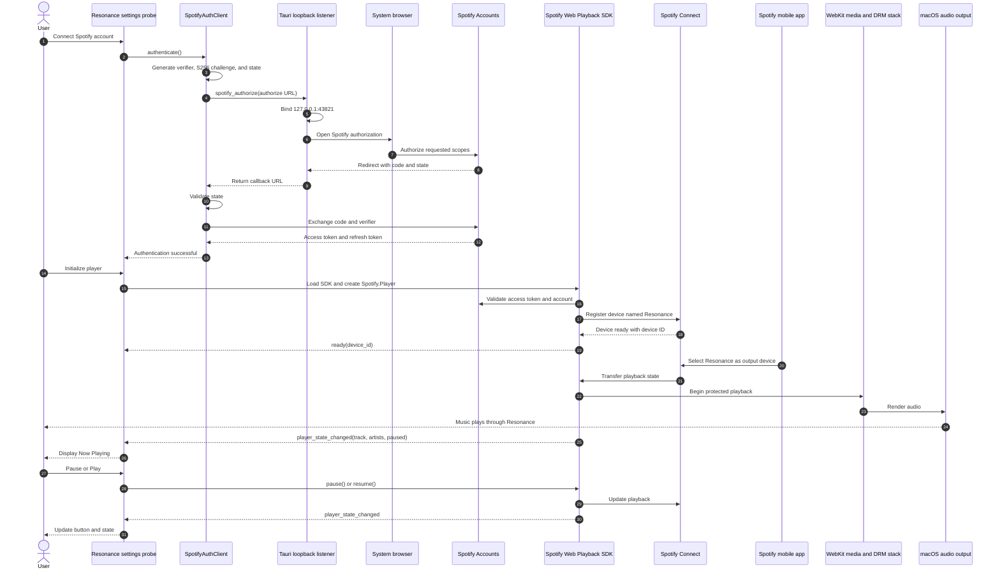
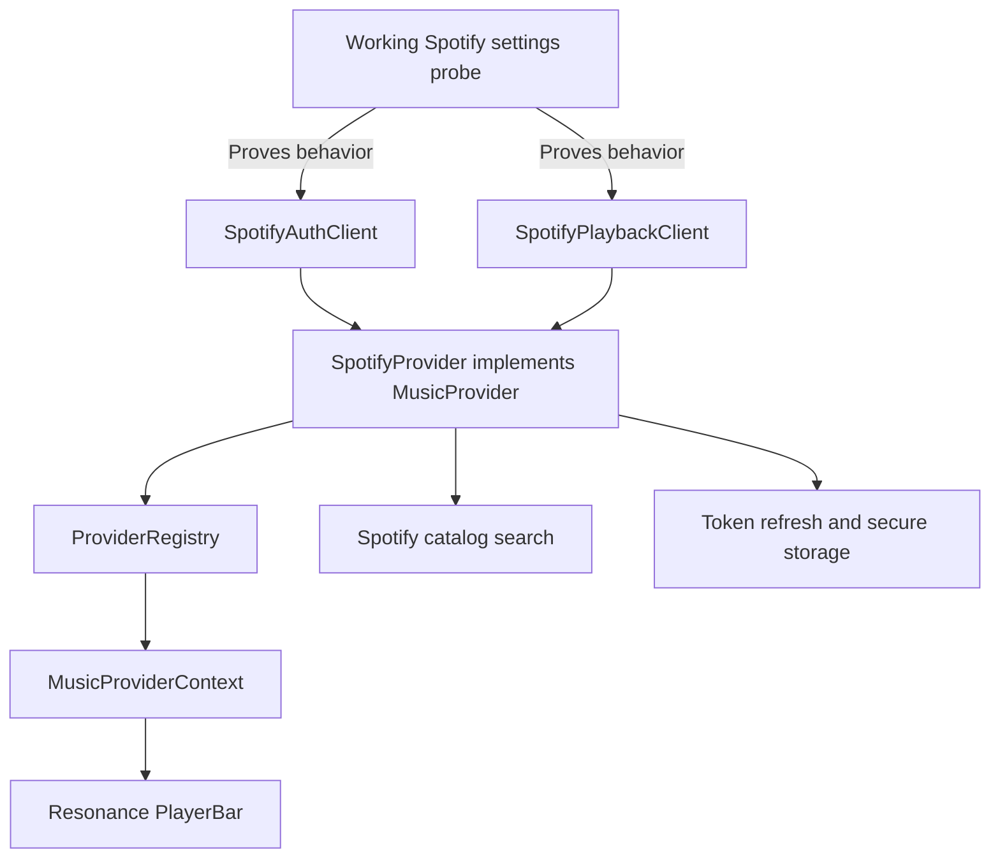

# Spotify Web Playback in Resonance

## Status

On 26 September 2026, Resonance successfully authenticated a Spotify Premium
account, initialized Spotify's Web Playback SDK inside the macOS Tauri webview,
registered itself as a Spotify Connect device, received playback transferred
from the Spotify mobile application, produced audible protected audio, received
live track metadata, and controlled playback with working pause and resume
actions.

This is the first confirmed provider playback in Resonance and the first time
the application produced music from a production streaming service.

The result establishes a viable Spotify playback path on the tested macOS
system. It does not establish equivalent support on Windows or Linux. Those
platforms use different system webviews and DRM integrations and must be tested
independently.

## Research Question

The experiment was designed to answer the following question:

> Can Spotify's Web Playback SDK initialize and perform real protected audio
> playback inside Resonance's Tauri webview on macOS?

Earlier EME probing established that the macOS webview exposed EME and accepted
an Apple FairPlay configuration. That result was encouraging but not decisive:
accepting a proposed EME configuration does not prove that a real provider SDK
can authenticate, create a licensed playback session, join Spotify Connect, or
play protected media.

The Spotify experiment therefore tested the actual provider path rather than a
synthetic EME configuration alone.

## Tested Environment

The successful test used:

- Resonance desktop version `0.0.2` under active development for `0.0.3`;
- Tauri 2;
- the macOS system webview backed by WebKit;
- a Spotify Premium account;
- Spotify's Authorization Code flow with PKCE;
- Spotify's Web Playback SDK loaded from
  `https://sdk.scdn.co/spotify-player.js`; and
- a Spotify mobile application as an independent Spotify Connect controller.

The development origin was the Tauri/Vite development environment. OAuth used
the loopback redirect:

```text
http://127.0.0.1:43821/callback
```

## Implemented Components

The proof of concept is divided into four layers.

### Tauri Loopback Callback

The Tauri backend temporarily binds `127.0.0.1:43821` before opening Spotify's
authorization page in the system browser. Binding first avoids a race in which
Spotify could redirect before Resonance is ready to receive the callback.

The backend:

1. validates that the authorization URL targets Spotify's authorization
   endpoint;
2. starts a temporary loopback HTTP listener;
3. opens the system browser;
4. receives the authorization callback;
5. displays a small Resonance-styled completion page in the browser; and
6. returns the complete callback URL to the frontend.

### PKCE Authentication

`SpotifyAuthClient` performs Authorization Code with PKCE without embedding a
Spotify client secret in the desktop application.

The implementation:

1. generates a cryptographically random verifier and OAuth state;
2. derives an `S256` code challenge using SHA-256 and base64url encoding;
3. asks the Tauri backend to open the authorization URL and receive the
   callback;
4. validates the returned OAuth state;
5. extracts the authorization code; and
6. exchanges the code and verifier for access and refresh tokens.

The final successful token contained these scopes:

```text
streaming
user-read-email
user-read-private
user-read-playback-state
user-modify-playback-state
```

Tokens currently exist in memory only. They are neither persisted nor written
to logs or the interface.

### Web Playback SDK Client

`SpotifyPlaybackClient` loads the Web Playback SDK dynamically and constructs a
`Spotify.Player` named `Resonance`. It supplies the in-memory access token to
Spotify through the SDK's `getOAuthToken` callback.

The client observes the following diagnostic events:

- `ready`;
- `not_ready`;
- `player_state_changed`;
- `initialization_error`;
- `authentication_error`;
- `account_error`;
- `playback_error`; and
- `autoplay_failed`.

It also exposes the initial control operations used by the proof of concept:

- audio activation through `activateElement()`;
- pause; and
- resume.

### Settings Probe Interface

The Settings probe provides explicit controls to:

- authenticate and disconnect the Spotify account;
- initialize the Web Playback SDK player;
- activate audio when WebKit's autoplay policy requires a local user gesture;
- inspect the resulting Spotify Connect device ID;
- display the current track and artists; and
- pause or resume playback.

The probe remains intentionally separate from Resonance's application-level
`MusicProvider` wiring. Its purpose is to prove and diagnose the provider
technology before moving the working behavior behind the common provider
contract.

## End-to-End Flow



## Observed Results

### 1. PKCE Authentication Succeeded

The system browser completed authorization and returned to Resonance's loopback
listener. Resonance validated the callback and exchanged the authorization
code successfully.

The probe reported:

```text
Spotify connected
Refresh token received: Yes
```

This proves the desktop PKCE and loopback architecture works on the tested
system without placing a Spotify client secret in Resonance.

### 2. The Initial SDK Attempt Rejected the Token Scopes

The first player initialization emitted:

```text
authentication: Invalid token scopes.
```

The token contained:

```text
streaming
user-modify-playback-state
user-read-playback-state
user-read-private
```

Spotify's Web Playback SDK implementation also required `user-read-email` for
this flow. Adding that scope and completing a new authorization produced a new
token with the required permission. Existing OAuth tokens cannot gain a scope
after issuance, so reauthorization was necessary.

This failure was useful: it proved that the SDK script loaded, the player was
constructed, and Spotify inspected the supplied token. The test had not failed
at the EME layer.

### 3. Player Initialization Succeeded

After reauthorization, the SDK emitted `ready` and returned a device ID. The
probe displayed:

```text
Spotify player ready
Device ID: <Spotify-generated device identifier>
```

The device identifier is intentionally omitted from this research record. It
is runtime diagnostic data and is not required to reproduce the architecture.

### 4. Independent Spotify Connect Discovery Succeeded

The Spotify mobile application independently listed `Resonance` as an
available playback device. This is stronger evidence than observing the SDK's
local callback alone: Spotify's external Connect infrastructure recognized the
new device and advertised it to another authenticated client.

### 5. The First Remote Transfer Was Blocked by Autoplay Policy

Selecting Resonance from the phone transferred playback successfully, but the
webview initially produced no audio and emitted:

```text
[spotify-playback]: Autoplay was blocked
```

This was not an EME, account, token, or Spotify Connect failure. The transfer
originated remotely and therefore lacked a direct user gesture inside the
webview. WebKit applied its autoplay policy before allowing audible media.

The SDK exposes `activateElement()` specifically to authorize playback through
a direct user interaction before a remote transfer. The probe added an
`Enable audio` control that invokes this method from a click.

During a later successful test, audio also played without pressing the explicit
`Enable audio` button. The likely explanation is that pressing the local Play
control in Resonance itself supplied the required user gesture. This is an
inference from the observed behavior, not a confirmed WebKit implementation
detail. The explicit activation path remains useful for preserving playback
during a transfer initiated from another Spotify client.

### 6. Audible Protected Playback Succeeded

Following player initialization and a permitted playback interaction, music
became audible through Resonance.

This is the central result of the experiment. The Web Playback SDK did not emit
an EME initialization error, and it completed real Spotify playback through the
Tauri webview. Since Spotify's internal licensing and media pipeline are opaque
to Resonance, this test does not expose the individual CDM messages or secret
content keys. It nevertheless provides direct end-to-end evidence that the
tested macOS runtime can satisfy Spotify's protected playback requirements.

### 7. Live Metadata and Bidirectional Controls Succeeded

Resonance subscribed to `player_state_changed` and displayed the actual track
and artist received from Spotify. The observed example was:

```text
Now Playing
Stained, Brutal Calamity — DM DOKURO
```

The probe's Pause control stopped playback. Spotify then emitted an updated
state, and Resonance changed the control to Play. Pressing Play resumed playback
and caused the interface to return to Pause.

This confirms bidirectional behavior:

```text
Spotify state -> Resonance interface
Resonance action -> Spotify playback
Spotify confirmation -> Resonance interface update
```

The interface deliberately treats Spotify's emitted state as authoritative.
It does not optimistically claim that playback changed merely because a local
method was invoked.

## What the Experiment Proves

On the tested macOS environment, Resonance can:

- securely authenticate Spotify using Authorization Code with PKCE;
- receive both access and refresh tokens;
- load and execute Spotify's Web Playback SDK inside Tauri;
- provide a token accepted by the SDK;
- initialize a Spotify player without an EME initialization error;
- register a real Spotify Connect device;
- expose that device to the Spotify mobile application;
- receive playback transferred from another Spotify client;
- produce audible Spotify audio;
- receive live track and playback-state metadata; and
- pause and resume playback from Resonance.

## What the Experiment Does Not Yet Prove

The result does not yet establish:

- equivalent behavior in a signed and distributed macOS build;
- support in the Windows WebView2 runtime;
- support in the default Linux WebKitGTK runtime;
- stable playback after access-token expiration;
- secure persistence of refresh tokens;
- automatic session restoration after restarting Resonance;
- catalog search or starting a selected track from Resonance;
- full PlayerBar controls such as seek, volume, next, previous, shuffle, and
  repeat;
- long-running recovery after network loss or a device becoming unavailable;
  or
- compliance decisions for distribution or commercial use.

The Linux investigation remains separate and unresolved. Enabling the EME API
in a custom WebKitGTK build did not provide a recognized production key system.
The successful macOS result must not be generalized to Linux.

## Security and Lifecycle Limitations

The proof of concept intentionally keeps tokens in memory. This is suitable for
an experiment but not for normal application use.

Before the provider is considered production-ready, Resonance needs:

- access-token refresh before expiration;
- secure storage for the refresh token using an operating-system-backed
  credential facility;
- token and session restoration during startup;
- explicit revocation or local credential removal during disconnect;
- protection against concurrent authorization attempts on the fixed loopback
  port;
- clearer cancellation and timeout behavior; and
- review of Spotify's current developer terms and playback policies before
  distribution.

## Transition from Probe to Provider

The next implementation step is to move the proven behavior behind
`SpotifyProvider implements MusicProvider`.



The intended first vertical slice is:

1. implement `SpotifyProvider` using the existing authentication and playback
   clients;
2. map Spotify SDK state into Resonance's canonical `PlaybackState` and `Track`
   models;
3. delegate pause, resume, seek, next, previous, and volume operations to the
   Spotify playback client;
4. register Spotify at the desktop application's composition boundary;
5. select Spotify as the active provider through an explicit temporary
   development mechanism; and
6. drive the existing bottom PlayerBar from the Spotify provider.

After that vertical slice, secure token persistence, refresh, provider
selection, search, and library integration can be developed without changing
the confirmed protected-playback foundation.

## Conclusion

The experiment answered its primary research question positively:

> Spotify protected audio playback is technically viable inside Resonance's
> tested macOS Tauri webview.

The successful path extended beyond initialization. Resonance became a Spotify
Connect device visible to an external client, rendered audible music, displayed
live metadata, and controlled playback. The primary macOS feasibility risk for
Spotify provider version `0.0.3` is therefore resolved.

Resonance has sung its first notes.
