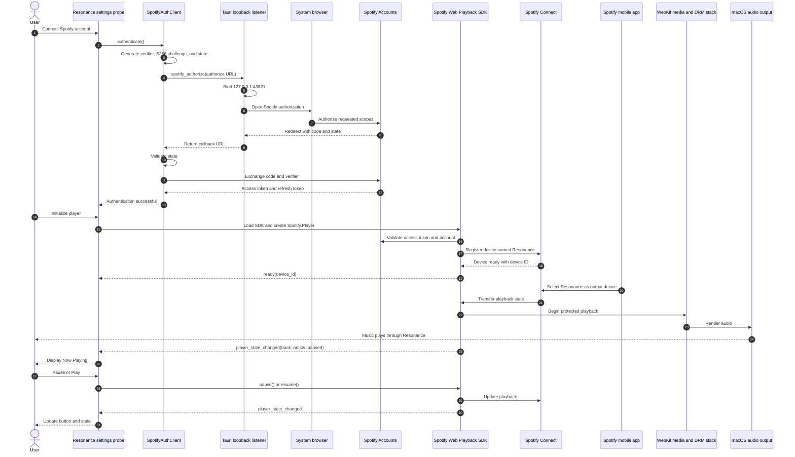
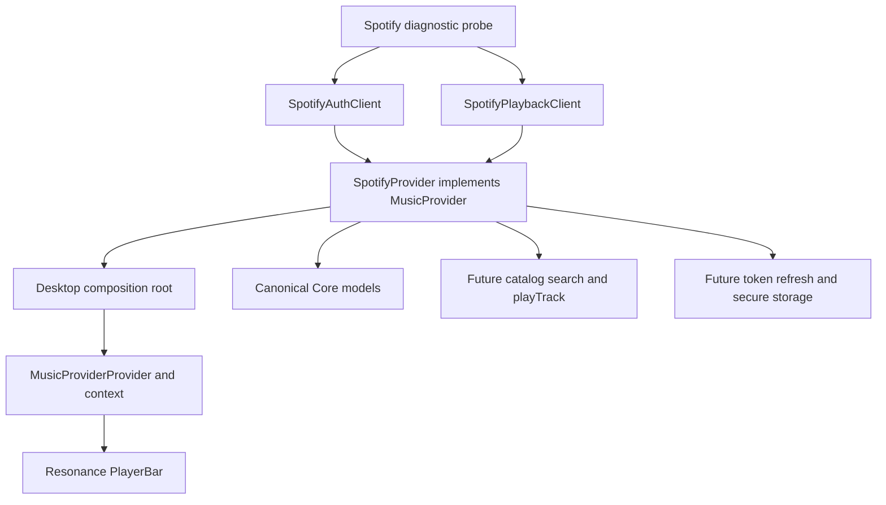

# Spotify Web Playback in Resonance

## Status

On 26 September 2026, Resonance successfully authenticated a Spotify Premium
account, initialized Spotify's Web Playback SDK inside the macOS Tauri webview,
registered itself as a Spotify Connect device, received playback transferred
from the Spotify mobile application, produced audible protected audio, received
live track metadata, and controlled playback with working pause and resume
actions.

On 27 September 2026, the proven Spotify path was integrated into Resonance's
provider architecture. Spotify now implements the shared `MusicProvider`
contract, publishes canonical Resonance playback models, can be selected as the
active application provider, and drives the real bottom PlayerBar. Pause,
resume, previous, next, seek, and volume controls were verified through the
application interface. The PlayerBar also interpolates elapsed playback time
between provider snapshots, allowing the progress control and elapsed-time
label to advance continuously while a track is playing.

This is the first confirmed provider playback in Resonance and the first time
the application produced music from a production streaming service.

The result establishes a viable Spotify playback path on the tested macOS
system. It does not establish equivalent support on Windows or Linux. Those
platforms use different system webviews and DRM integrations and must be tested
independently.

## Research Question

The experiment was designed to answer the following question:

> Can Spotify's Web Playback SDK initialize and perform real protected audio
> playback inside Resonance's Tauri webview on macOS?

Earlier EME probing established that the macOS webview exposed EME and accepted
an Apple FairPlay configuration. That result was encouraging but not decisive:
accepting a proposed EME configuration does not prove that a real provider SDK
can authenticate, create a licensed playback session, join Spotify Connect, or
play protected media.

The Spotify experiment therefore tested the actual provider path rather than a
synthetic EME configuration alone.

## Tested Environment

The successful test used:

- Resonance desktop version `0.0.2` under active development for `0.0.3`;
- Tauri 2;
- the macOS system webview backed by WebKit;
- a Spotify Premium account;
- Spotify's Authorization Code flow with PKCE;
- Spotify's Web Playback SDK loaded from
  `https://sdk.scdn.co/spotify-player.js`; and
- a Spotify mobile application as an independent Spotify Connect controller.

The development origin was the Tauri/Vite development environment. OAuth used
the loopback redirect:

```text
http://127.0.0.1:43821/callback
```

## Implemented Components

The implementation is divided into the following layers.

### Tauri Loopback Callback

The Tauri backend temporarily binds `127.0.0.1:43821` before opening Spotify's
authorization page in the system browser. Binding first avoids a race in which
Spotify could redirect before Resonance is ready to receive the callback.

The backend:

1. validates that the authorization URL targets Spotify's authorization
   endpoint;
2. starts a temporary loopback HTTP listener;
3. opens the system browser;
4. receives the authorization callback;
5. displays a small Resonance-styled completion page in the browser; and
6. returns the complete callback URL to the frontend.

### PKCE Authentication

`SpotifyAuthClient` performs Authorization Code with PKCE without embedding a
Spotify client secret in the desktop application.

The implementation:

1. generates a cryptographically random verifier and OAuth state;
2. derives an `S256` code challenge using SHA-256 and base64url encoding;
3. asks the Tauri backend to open the authorization URL and receive the
   callback;
4. validates the returned OAuth state;
5. extracts the authorization code; and
6. exchanges the code and verifier for access and refresh tokens.

The final successful token contained these scopes:

```text
streaming
user-read-email
user-read-private
user-read-playback-state
user-modify-playback-state
```

Tokens currently exist in memory only. They are neither persisted nor written
to logs or the interface.

### Web Playback SDK Client

`SpotifyPlaybackClient` loads the Web Playback SDK dynamically and constructs a
`Spotify.Player` named `Resonance`. It supplies the in-memory access token to
Spotify through the SDK's `getOAuthToken` callback.

The client observes the following diagnostic events:

- `ready`;
- `not_ready`;
- `player_state_changed`;
- `initialization_error`;
- `authentication_error`;
- `account_error`;
- `playback_error`; and
- `autoplay_failed`.

It also exposes the initial control operations used by the proof of concept:

- audio activation through `activateElement()`;
- pause; and
- resume.

### Settings Probe Interface

The Settings probe provides explicit controls to:

- authenticate and disconnect the Spotify account;
- initialize the Web Playback SDK player;
- activate audio when WebKit's autoplay policy requires a local user gesture;
- inspect the resulting Spotify Connect device ID;
- display the current track and artists; and
- pause or resume playback.

The probe was intentionally created before application-level provider wiring.
Its purpose was to prove and diagnose the provider technology in isolation.
It remains useful as a diagnostic surface, but it is no longer the only path
through which Spotify is exercised.

### Spotify MusicProvider Adapter

`SpotifyProvider` now implements Resonance's provider-neutral `MusicProvider`
contract. It composes `SpotifyAuthClient` and `SpotifyPlaybackClient`, keeping
OAuth and Web Playback SDK details behind the provider boundary.

The adapter currently:

- authenticates the user and initializes the SDK player;
- translates Spotify SDK state into Resonance's canonical `PlaybackState`;
- maps Spotify tracks, artists, albums, artwork, duration, position, and
  playability into canonical Core models;
- assigns collision-resistant Resonance IDs using the convention
  `provider:resource-type:provider-local-id`;
- publishes provider-originated state changes through
  `subscribeToPlaybackState()`;
- delegates resume, pause, seek, next, previous, and volume operations to the
  Spotify playback client; and
- advertises only the capabilities that are currently implemented.

Catalogue search and `playTrack()` remain intentionally disabled. The current
vertical slice controls an existing Spotify playback context rather than
starting an arbitrary catalogue item.

### Application Provider Selection

Concrete providers are created at the desktop composition boundary and exposed
to React through `MusicProviderProvider`. The context tracks connection status
separately from active-provider selection. The Settings interface can connect,
activate, and disconnect Spotify while retaining the mock provider as an
always-available fallback.

Application components consume the active provider through the shared Core
contract. They do not import Spotify's concrete implementation or branch on the
Spotify provider ID to perform playback operations.

### Application PlayerBar

The normal Resonance PlayerBar is now driven by canonical state from the active
provider. The following operations were tested successfully with Spotify:

- play and pause;
- previous and next track;
- seeking within the current track; and
- volume adjustment.

The PlayerBar displays canonical artwork, title, artists, elapsed time, and
duration. Unsupported controls such as shuffle and repeat remain disabled based
on provider capability declarations.

Spotify's `player_state_changed` event supplies authoritative snapshots, but it
does not act as a once-per-second playback clock. An initial implementation
therefore left the progress slider stationary until another SDK event occurred,
most visibly when playback was paused. The PlayerBar now treats the provider
position as an authoritative synchronization point and locally interpolates the
visible position while playback is active. It uses elapsed monotonic time rather
than adding a fixed amount per interval, clamps progress to the track duration,
stops interpolation while paused, and resynchronizes whenever the provider emits
a new snapshot. Seeking also updates the displayed position immediately before
the provider confirms later state.

This interpolation is intentionally a presentation concern. The provider does
not manufacture artificial playback events every second, and its snapshots
remain the source of truth.

## End-to-End Flow


```mermaid
sequenceDiagram
    autonumber

    actor User
    participant Probe as Resonance settings probe
    participant Auth as SpotifyAuthClient
    participant Tauri as Tauri loopback listener
    participant Browser as System browser
    participant Accounts as Spotify Accounts
    participant SDK as Spotify Web Playback SDK
    participant Connect as Spotify Connect
    participant Phone as Spotify mobile app
    participant WebKit as WebKit media and DRM stack
    participant Output as macOS audio output

    User->>Probe: Connect Spotify account
    Probe->>Auth: authenticate()
    Auth->>Auth: Generate verifier, S256 challenge, and state
    Auth->>Tauri: spotify_authorize(authorize URL)
    Tauri->>Tauri: Bind 127.0.0.1:43821
    Tauri->>Browser: Open Spotify authorization
    Browser->>Accounts: Authorize requested scopes
    Accounts-->>Tauri: Redirect with code and state
    Tauri-->>Auth: Return callback URL
    Auth->>Auth: Validate state
    Auth->>Accounts: Exchange code and verifier
    Accounts-->>Auth: Access token and refresh token
    Auth-->>Probe: Authentication successful

    User->>Probe: Initialize player
    Probe->>SDK: Load SDK and create Spotify.Player
    SDK->>Accounts: Validate access token and account
    SDK->>Connect: Register device named Resonance
    Connect-->>SDK: Device ready with device ID
    SDK-->>Probe: ready(device_id)

    Phone->>Connect: Select Resonance as output device
    Connect->>SDK: Transfer playback state
    SDK->>WebKit: Begin protected playback
    WebKit->>Output: Render audio
    Output-->>User: Music plays through Resonance

    SDK-->>Probe: player_state_changed(track, artists, paused)
    Probe-->>User: Display Now Playing

    User->>Probe: Pause or Play
    Probe->>SDK: pause() or resume()
    SDK->>Connect: Update playback
    SDK-->>Probe: player_state_changed
    Probe-->>User: Update button and state
```

## Observed Results

### 1. PKCE Authentication Succeeded

The system browser completed authorization and returned to Resonance's loopback
listener. Resonance validated the callback and exchanged the authorization
code successfully.

The probe reported:

```text
Spotify connected
Refresh token received: Yes
```

This proves the desktop PKCE and loopback architecture works on the tested
system without placing a Spotify client secret in Resonance.

### 2. The Initial SDK Attempt Rejected the Token Scopes

The first player initialization emitted:

```text
authentication: Invalid token scopes.
```

The token contained:

```text
streaming
user-modify-playback-state
user-read-playback-state
user-read-private
```

Spotify's Web Playback SDK implementation also required `user-read-email` for
this flow. Adding that scope and completing a new authorization produced a new
token with the required permission. Existing OAuth tokens cannot gain a scope
after issuance, so reauthorization was necessary.

This failure was useful: it proved that the SDK script loaded, the player was
constructed, and Spotify inspected the supplied token. The test had not failed
at the EME layer.

### 3. Player Initialization Succeeded

After reauthorization, the SDK emitted `ready` and returned a device ID. The
probe displayed:

```text
Spotify player ready
Device ID: <Spotify-generated device identifier>
```

The device identifier is intentionally omitted from this research record. It
is runtime diagnostic data and is not required to reproduce the architecture.

### 4. Independent Spotify Connect Discovery Succeeded

The Spotify mobile application independently listed `Resonance` as an
available playback device. This is stronger evidence than observing the SDK's
local callback alone: Spotify's external Connect infrastructure recognized the
new device and advertised it to another authenticated client.

### 5. The First Remote Transfer Was Blocked by Autoplay Policy

Selecting Resonance from the phone transferred playback successfully, but the
webview initially produced no audio and emitted:

```text
[spotify-playback]: Autoplay was blocked
```

This was not an EME, account, token, or Spotify Connect failure. The transfer
originated remotely and therefore lacked a direct user gesture inside the
webview. WebKit applied its autoplay policy before allowing audible media.

The SDK exposes `activateElement()` specifically to authorize playback through
a direct user interaction before a remote transfer. The probe added an
`Enable audio` control that invokes this method from a click.

During a later successful test, audio also played without pressing the explicit
`Enable audio` button. The likely explanation is that pressing the local Play
control in Resonance itself supplied the required user gesture. This is an
inference from the observed behavior, not a confirmed WebKit implementation
detail. The explicit activation path remains useful for preserving playback
during a transfer initiated from another Spotify client.

### 6. Audible Protected Playback Succeeded

Following player initialization and a permitted playback interaction, music
became audible through Resonance.

This is the central result of the experiment. The Web Playback SDK did not emit
an EME initialization error, and it completed real Spotify playback through the
Tauri webview. Since Spotify's internal licensing and media pipeline are opaque
to Resonance, this test does not expose the individual CDM messages or secret
content keys. It nevertheless provides direct end-to-end evidence that the
tested macOS runtime can satisfy Spotify's protected playback requirements.

### 7. Live Metadata and Bidirectional Controls Succeeded

Resonance subscribed to `player_state_changed` and displayed the actual track
and artist received from Spotify. The observed example was:

```text
Now Playing
Stained, Brutal Calamity — DM DOKURO
```

The probe's Pause control stopped playback. Spotify then emitted an updated
state, and Resonance changed the control to Play. Pressing Play resumed playback
and caused the interface to return to Pause.

This confirms bidirectional behavior:

```text
Spotify state -> Resonance interface
Resonance action -> Spotify playback
Spotify confirmation -> Resonance interface update
```

The interface deliberately treats Spotify's emitted state as authoritative.
It does not optimistically claim that playback changed merely because a local
method was invoked.

## What the Experiment Proves

On the tested macOS environment, Resonance can:

- securely authenticate Spotify using Authorization Code with PKCE;
- receive both access and refresh tokens;
- load and execute Spotify's Web Playback SDK inside Tauri;
- provide a token accepted by the SDK;
- initialize a Spotify player without an EME initialization error;
- register a real Spotify Connect device;
- expose that device to the Spotify mobile application;
- receive playback transferred from another Spotify client;
- produce audible Spotify audio;
- receive live track and playback-state metadata;
- translate Spotify state into Resonance's canonical provider-neutral models;
- operate Spotify through the shared `MusicProvider` contract;
- drive the normal Resonance PlayerBar from Spotify state;
- pause and resume playback from Resonance;
- move to the previous or next track;
- seek within the current track;
- adjust playback volume; and
- present continuously advancing elapsed time between authoritative SDK state
  snapshots.

## What the Experiment Does Not Yet Prove

The result does not yet establish:

- equivalent behavior in a signed and distributed macOS build;
- support in the Windows WebView2 runtime;
- support in the default Linux WebKitGTK runtime;
- stable playback after access-token expiration;
- secure persistence of refresh tokens;
- automatic session restoration after restarting Resonance;
- catalog search or starting a selected track from Resonance;
- shuffle and repeat controls;
- long-running recovery after network loss or a device becoming unavailable;
  or
- compliance decisions for distribution or commercial use.

The Linux investigation remains separate and unresolved. Enabling the EME API
in a custom WebKitGTK build did not provide a recognized production key system.
The successful macOS result must not be generalized to Linux.

## Security and Lifecycle Limitations

The proof of concept intentionally keeps tokens in memory. This is suitable for
an experiment but not for normal application use.

Before the provider is considered production-ready, Resonance needs:

- access-token refresh before expiration;
- secure storage for the refresh token using an operating-system-backed
  credential facility;
- token and session restoration during startup;
- explicit revocation or local credential removal during disconnect;
- protection against concurrent authorization attempts on the fixed loopback
  port;
- clearer cancellation and timeout behavior; and
- review of Spotify's current developer terms and playback policies before
  distribution.

## Completed Transition from Probe to Provider

The initial research report proposed moving the proven probe behavior behind
`SpotifyProvider implements MusicProvider`. That vertical slice is now
complete.


```mermaid
flowchart TD
    Probe[Spotify diagnostic probe]
    Auth[SpotifyAuthClient]
    Playback[SpotifyPlaybackClient]
    Provider[SpotifyProvider implements MusicProvider]
    Composition[Desktop composition root]
    Context[MusicProviderProvider and context]
    PlayerBar[Resonance PlayerBar]
    Models[Canonical Core models]
    Search[Future catalog search and playTrack]
    Storage[Future token refresh and secure storage]

    Probe --> Auth
    Probe --> Playback
    Auth --> Provider
    Playback --> Provider
    Provider --> Models
    Provider --> Composition
    Composition --> Context
    Context --> PlayerBar
    Provider --> Search
    Provider --> Storage
```

The completed vertical slice includes provider construction at the composition
root, explicit connect/activate/disconnect behavior in Settings, canonical
playback-state propagation, capability-aware controls, and full PlayerBar
operation for the controls presently implemented by Spotify.

The next provider milestone can build catalogue search and `playTrack()` on top
of this foundation. Secure token persistence and refresh remain necessary
lifecycle work before the integration is production-ready.

## Conclusion

The experiment answered its primary research question positively:

> Spotify protected audio playback is technically viable inside Resonance's
> tested macOS Tauri webview.

The successful path extended beyond initialization. Resonance became a Spotify
Connect device visible to an external client, rendered audible music, translated
Spotify state through its provider-neutral architecture, displayed live metadata
in the real PlayerBar, and controlled playback through that shared contract. The
primary macOS feasibility risk for Spotify provider version `0.0.3` is therefore
resolved, and the first complete provider-to-interface playback slice has been
demonstrated.

Resonance has sung its first notes.
