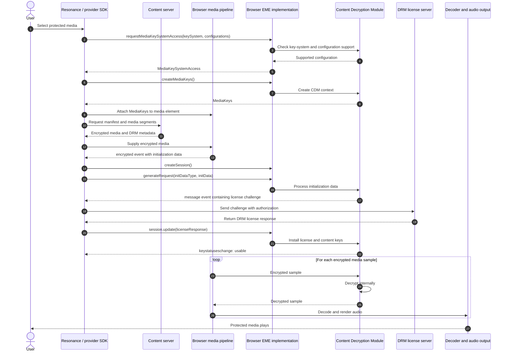
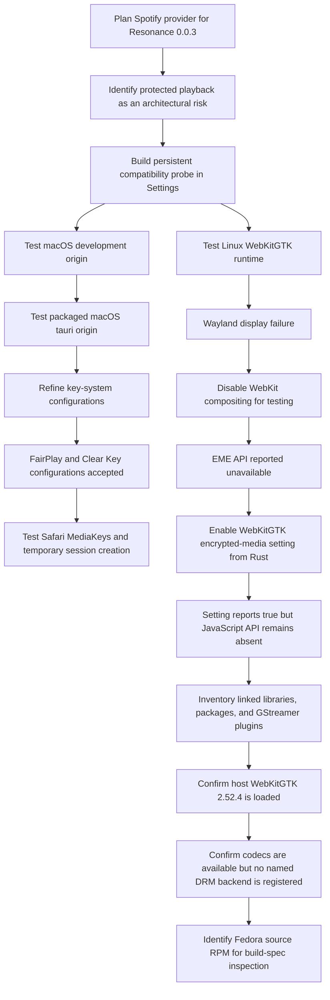
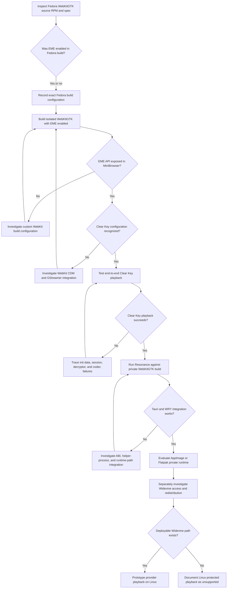

# WebKit, EME, and Protected Playback Research

## Status

This document records the protected-playback investigation performed before
implementing the Spotify provider planned for Resonance 0.0.3. It is a research
record, not a settled architectural decision.

The immediate question is whether Resonance can perform protected music
playback inside its Tauri webview on each supported desktop platform. The
investigation began after identifying that Spotify and Apple Music playback may
depend on Encrypted Media Extensions (EME) and a platform-supported Content
Decryption Module (CDM).

The findings in this document distinguish between:

- behaviour directly observed in Resonance;
- behaviour observed in a standalone browser;
- facts established by upstream documentation or source;
- inferences that still require confirmation; and
- capabilities that have not yet been tested.

## Why This Matters to Resonance

Resonance is intended to play music from services such as Spotify and Apple
Music through provider implementations. Metadata access and playback access
are separate problems: a service API may expose tracks, albums, and playlists
while requiring a protected browser or native playback environment for the
audio stream itself.

If the runtime cannot expose the DRM system expected by a provider, the
provider may still be able to search or manage a library, but it cannot perform
in-application playback. Since in-application playback is a central goal of
Resonance, this is an architectural constraint rather than an isolated browser
compatibility issue.

## Practical Model of EME

EME is not a DRM implementation and does not decrypt media itself. It defines
the browser-facing interface used by an application to negotiate a key system,
create a playback session, exchange opaque licensing messages, and report the
status of the keys held by a CDM.

The main participants are:

- **Resonance or a provider SDK**, which coordinates playback and transports
  messages between the CDM and a service;
- **the browser EME implementation**, which exposes objects such as
  `MediaKeySystemAccess`, `MediaKeys`, and `MediaKeySession`;
- **the CDM**, such as Widevine, FairPlay, PlayReady, or Clear Key, which
  implements the key-system-specific behaviour and holds key material;
- **the provider's license service**, which evaluates the request and returns a
  DRM-specific license response; and
- **the media pipeline**, which demuxes and decodes media after protected
  samples have been decrypted.



The application normally sees the license challenge and response only as
opaque binary messages. It does not receive the secret content key or decrypted
audio. EME also does not standardize a provider's authentication, license
server URL, request format, response format, or authorization policy.

### Configuration Terms

The EME configuration probe uses several related but distinct values:

- A **key system** identifies a DRM implementation, for example
  `com.widevine.alpha`, `com.apple.fps`, or `org.w3.clearkey`.
- An **initialization-data type** describes the format of the protection
  metadata given to the CDM, for example `cenc`, `sinf`, `webm`, or `keyids`.
- A **content type** describes the media container and codec, for example
  `audio/mp4; codecs="mp4a.40.2"`.
- An **encryption scheme** describes how protected media samples are encrypted,
  for example `cenc` or `cbcs`.

The term `cenc` may identify both an initialization-data format and a sample
encryption scheme. Those uses describe separate parts of a configuration.

Acceptance by `requestMediaKeySystemAccess()` means that the runtime accepted
at least one complete proposed configuration. It does not prove that a provider
will authenticate the user, issue a license, or authorize that embedded
runtime.

## Resonance Compatibility Probe

Resonance contains a protected-playback compatibility probe in Settings. The
probe records:

- whether the document is a secure context;
- whether `navigator.requestMediaKeySystemAccess` is available;
- the current origin and user agent; and
- whether the runtime accepts one of several configurations proposed for each
  tested key system.

The current candidates are:

| Label | Key system | Principal configuration under test |
| --- | --- | --- |
| Widevine | `com.widevine.alpha` | `cenc`, AAC/MP4 with `cenc`; WebM/Opus; broader audio matrix |
| Apple FairPlay | `com.apple.fps` | `sinf`, AAC/MP4 with `cbcs`; fallback configurations |
| Apple FairPlay legacy identifier | `com.apple.fps.1_0` | `sinf`, AAC/MP4 with `cbcs`; broader audio matrix |
| Microsoft PlayReady | `com.microsoft.playready` | `cenc`, AAC/MP4 with `cenc`; broader audio matrix |
| W3C Clear Key control | `org.w3.clearkey` | `cenc`, AAC/MP4 with `cenc`; broader audio matrix |

Clear Key acts as a useful control because it exercises the EME lifecycle
without requiring a proprietary production DRM system. Recognizing Clear Key
does not imply that Widevine, FairPlay, or PlayReady is available.

The probe currently stops after configuration negotiation. It does not yet:

- call `createMediaKeys()`;
- attach `MediaKeys` to the player;
- supply valid initialization data;
- generate a license challenge;
- contact a provider license service; or
- play an encrypted sample.

It therefore measures runtime capability, not end-to-end provider playback.

## macOS Findings

### Observed in Resonance

Both development and packaged Resonance builds expose the EME API on macOS.
The tested origins were:

- `http://localhost:1420` during development; and
- `tauri://localhost` in the packaged application.

The compatibility probe observed:

- a secure context;
- an available EME API;
- accepted FairPlay configurations for `com.apple.fps` and
  `com.apple.fps.1_0`;
- a selected FairPlay configuration using `sinf` initialization data,
  `audio/mp4; codecs="mp4a.40.2"`, and `cbcs` encryption;
- accepted W3C Clear Key configuration; and
- no accepted tested Widevine or PlayReady configuration.

The packaged application's result is particularly relevant because it shows
that the `tauri://localhost` origin does not itself prevent FairPlay
configuration negotiation.

### Observed in Safari

The equivalent FairPlay request on Safari at `http://localhost:1420` produced a
`MediaKeySystemAccess` object. Calling `getConfiguration()` returned a selected
configuration containing:

- `initDataTypes: ["sinf"]`;
- AAC in MP4;
- `encryptionScheme: "cbcs"`;
- `distinctiveIdentifier: "not-allowed"`; and
- `persistentState: "not-allowed"`.

The original request marked distinctive identifiers and persistent state as
optional. Safari selected a stricter configuration that does not use either.
This is allowed: the application proposes acceptable alternatives and the
runtime returns the configuration it selected.

Safari also successfully created a `MediaKeys` object and a temporary
`MediaKeySession`. The new session initially had an empty session ID and no key
statuses, which is expected before valid initialization data has been processed
and a license installed.

### What the macOS Result Does Not Prove

These observations establish that the macOS WebKit environment can negotiate
and instantiate the tested FairPlay configuration. They do not establish that:

- Spotify uses FairPlay for the intended Web Playback integration;
- Apple Music or Spotify will authorize Resonance's embedded origin;
- a service will issue a license to the WKWebView;
- the provider SDK permits this environment; or
- encrypted audio will complete playback successfully.

An actual provider SDK and license exchange remain necessary.

## Linux Test Environment

The Linux investigation was performed on:

| Property | Observed value |
| --- | --- |
| Distribution | Bazzite 44, based on Fedora Silverblue |
| Image variant | `bazzite-gnome-nvidia-open` |
| Architecture | `x86_64` |
| Session | Wayland |
| Kernel | `7.0.9-ogc3.2.fc44.x86_64` |
| WebKitGTK package | `webkit2gtk4.1-2.52.4-1.fc44.x86_64` |
| Source RPM | `webkitgtk-2.52.4-1.fc44.src.rpm` |
| GStreamer | `1.28.3` |

The `/var/home/...` repository path seen in earlier output is expected on a
Silverblue-style system and does not by itself indicate that Resonance is using
an unrelated container runtime.

### Actual Libraries Loaded by Resonance

`ldd` on the Resonance executable showed direct use of:

```text
/lib64/libwebkit2gtk-4.1.so.0
/lib64/libjavascriptcoregtk-4.1.so.0
```

along with the host GStreamer libraries. `pkg-config` reported `/usr/lib64` as
the WebKitGTK library directory. Fedora's merged system-library layout accounts
for the `/lib64` and `/usr/lib64` paths; this is not evidence of two different
WebKit installations.

The result establishes that Resonance is using Bazzite's host WebKitGTK 2.52.4,
not an unexpected private or stale copy.

## Linux Runtime Findings

### Wayland and Compositing

Running the application normally under Wayland previously failed with an error
while dispatching to the Wayland display. Starting it with:

```bash
WEBKIT_DISABLE_COMPOSITING_MODE=1 pnpm --filter @resonance/desktop tauri dev
```

allowed the application to display. The same environment variable was needed
when testing the native release executable.

This is currently treated as a rendering/compositing problem independent from
EME. Disabling compositing can allow the window to run, but it cannot add a web
platform feature omitted from the WebKitGTK binary.

### Attempt to Enable EME Through WebKitSettings

Resonance currently accesses the native Linux webview during Tauri setup and
calls:

```rust
settings.set_enable_encrypted_media(true);
```

The getter subsequently prints:

```text
WebKitGTK encrypted media enabled: true
```

Despite this, the compatibility probe reports:

```text
EME API: Unavailable
```

and `navigator.requestMediaKeySystemAccess` is absent. Reloading the webview
after changing the preference did not change the result.

This demonstrates an important distinction: the settings object accepts and
returns the preference value, but the JavaScript implementation required to
honour that preference is not present in the running WebKitGTK environment.

WebKitGTK's documentation explicitly states that the
`enable-encrypted-media` property only works as intended when WebKitGTK was
built with `ENABLE_ENCRYPTED_MEDIA`. The property existing and reading `true`
does not establish that the feature was compiled into the library.

### WebKitGTK Build Defaults

Upstream WebKit defines `ENABLE_ENCRYPTED_MEDIA` as off by default. The GTK
port then makes its default follow `ENABLE_EXPERIMENTAL_FEATURES`:

```cmake
WEBKIT_OPTION_DEFAULT_PORT_VALUE(
    ENABLE_ENCRYPTED_MEDIA
    PRIVATE
    ${ENABLE_EXPERIMENTAL_FEATURES}
)
```

`ENABLE_EXPERIMENTAL_FEATURES` is also off by default. Unless a distribution
overrides these values when producing WebKitGTK, EME is compiled out.

The runtime evidence strongly indicates that Fedora's WebKitGTK 2.52.4 package
was built without usable EME support. Inspecting
`webkitgtk-2.52.4-1.fc44.src.rpm` is the next step needed to confirm the exact
Fedora build arguments. Until that source package is inspected, this remains a
well-supported inference rather than a directly observed packaging fact.

### Media Container and Codec Support

The Linux system has GStreamer support for the relevant unencrypted media
formats, including:

- `qtdemux` for MP4/QuickTime demuxing;
- AAC parsing;
- `faad`, `fdkaacdec`, and libav AAC decoders;
- Opus parsing and decoding; and
- WebM demuxing/muxing support.

The current failure occurs before these components are reached. The absence of
the browser EME API prevents key-system negotiation, license exchange, and
decryption from beginning. The findings therefore do not indicate a general
AAC, Opus, MP4, or WebM decoding failure.

### DRM and Decryptor Search

A corrected search of the registered GStreamer elements produced no output for
Widevine, OpenCDM, Thunder, Clear Key, or decryptor-related names:

```bash
gst-inspect-1.0 |
  grep -Ei 'widevine|opencdm|thunder|clearkey|decryptor|decrypt'
```

The original diagnostic used the shorter pattern `eme`, which unintentionally
matched the suffix of the word `element` and produced false positives. Those
results were ordinary GStreamer elements and not evidence of DRM support.

The corrected empty result establishes that no correspondingly named external
GStreamer DRM/decryptor plugin is registered. It does not prove that no DRM
code exists anywhere inside WebKitGTK, because a WebKit-integrated Clear Key or
CDM implementation need not be exposed as a generally discoverable GStreamer
plugin. Combined with the missing JavaScript EME API, however, there is no
evidence of a usable CDM path in the current runtime.

## Current Layer-by-Layer Assessment

| Layer | macOS result | Linux result |
| --- | --- | --- |
| Secure application context | Available | Available |
| `requestMediaKeySystemAccess` | Available | Unavailable |
| FairPlay configuration negotiation | Accepted | Not reached |
| Widevine configuration negotiation | Tested configurations rejected | Not reached |
| Clear Key configuration negotiation | Accepted | Not reached |
| `MediaKeys` creation | Confirmed in Safari | Not reached |
| Temporary session creation | Confirmed in Safari | Not reached |
| Valid initialization data | Not yet tested | Not reached |
| License challenge | Not yet tested | Not reached |
| Provider license | Not yet tested | Not reached |
| Protected audio playback | Not yet tested | Not reached |

The most precise statement supported by current evidence is:

> The WebKitGTK binary supplied by the tested Bazzite/Fedora environment does
> not expose EME to Resonance. The runtime preference can be set, but the
> corresponding JavaScript API remains absent, which strongly indicates that
> encrypted-media support was omitted when the WebKitGTK package was built.

It is not yet accurate to conclude that EME is impossible on Linux generally.

## Investigation Path to Date



## Current Decision Tree

The next experiments should increase in cost only after the preceding layer is
proven. A custom WebKitGTK build is initially a research tool, not a production
packaging decision.



## Bundling a Private WebKitGTK Runtime

It is technically possible to distribute Resonance with a private WebKitGTK
build, particularly inside an AppImage or Flatpak. It is not equivalent to
including one shared library. A compatible runtime must include the WebKitGTK
and JavaScriptCore libraries, WebKit helper processes, injected bundle,
resources, and a coherent set of dependent libraries and media plugins.

The libraries and helper processes must come from the same build. A bundled
WebKit library launching host helper processes from another version can fail.
Bundling GLib, GStreamer, Wayland, or graphics dependencies can also conflict
with newer host Mesa and driver stacks.

Before considering production packaging, Resonance should prove the following
in isolation:

1. A custom WebKitGTK build exposes EME in MiniBrowser.
2. The build recognizes and plays a Clear Key sample.
3. Tauri/WRY can run against that private build.
4. WebKit's helper processes and resources can be located reliably.
5. The private runtime works under both Wayland and X11 on supported systems.
6. A legitimate and maintainable CDM distribution path exists.

Even a successful EME-enabled WebKitGTK build does not automatically provide
Widevine. Widevine is proprietary and requires an approved integration and
distribution arrangement. The technical and legal availability of the CDM is
separate from the ability to compile WebKit's EME-facing code.

Distributing WebKit also introduces license-notice, corresponding-source, and
security-update responsibilities. WebKit contains code under BSD and LGPL
licenses. These obligations must be reviewed before Resonance distributes a
modified private build.

## Alternative Runtime Direction

Replacing WebKitGTK with Chromium Embedded Framework (CEF) is not a simple
Tauri 2 configuration change. Tauri's CEF runtime work provides a possible
future or experimental engine path, but changing the browser engine does not
remove the CDM problem: standard CEF distributions do not bundle a licensed
Widevine CDM, and proprietary codecs may introduce separate distribution
requirements.

The relevant question is therefore not only whether Resonance can embed a
different engine, but whether Resonance can distribute an engine, CDM, and
codec combination accepted by the target provider.

## Next Investigation

The next action is to obtain or inspect:

```text
webkitgtk-2.52.4-1.fc44.src.rpm
```

The investigation should record:

- the Fedora `.spec` file;
- all CMake arguments used for WebKitGTK 4.1;
- the value of `ENABLE_EXPERIMENTAL_FEATURES`;
- whether `ENABLE_ENCRYPTED_MEDIA` is explicitly overridden;
- whether Thunder support is enabled;
- which GStreamer-related build dependencies are present; and
- whether Fedora carries patches affecting encrypted media.

If the package did not enable EME, the next controlled experiment is an
isolated WebKitGTK 2.52.4 build with EME enabled, followed by MiniBrowser and
Clear Key tests. Resonance packaging should not change until those tests prove
that the custom engine provides a useful capability.

## References

- [W3C Encrypted Media Extensions](https://w3c.github.io/encrypted-media/)
- [WebKitGTK `enable-encrypted-media` setting](https://webkitgtk.org/reference/webkit2gtk/2.38.5/property.Settings.enable-encrypted-media.html)
- [WebKit feature defaults](https://github.com/WebKit/WebKit/blob/main/Source/cmake/WebKitFeatures.cmake)
- [WebKit GTK build options](https://github.com/WebKit/WebKit/blob/main/Source/cmake/OptionsGTK.cmake)
- [WebKitGTK EME and Thunder implementation overview](https://planet.webkitgtk.org/)
- [Google Widevine overview](https://developers.google.com/widevine/drm/overview)
- [Google Widevine access requirements](https://developers.google.com/widevine/access)
- [WebKit licensing](https://webkit.org/licensing-webkit/)
- [Tauri AppImage configuration source](https://github.com/tauri-apps/tauri/blob/dev/crates/tauri-utils/src/config.rs)
- [Tauri AppImage WebKit helper mismatch report](https://github.com/tauri-apps/tauri/issues/15665)
