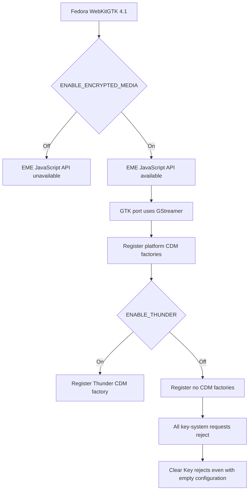

# WebKitGTK EME Enablement Build

## Status

This document records the first experimental Fedora WebKitGTK build performed
for Resonance with Encrypted Media Extensions (EME) explicitly enabled. It
continues the source and packaging investigation documented in
[`webkitgtk_investigation.md`](./webkitgtk_investigation.md).

The first build completed successfully and changed the observable runtime
behaviour of WebKitGTK: the EME JavaScript API became available in Resonance on
Linux. No tested key system was recognized, however. Subsequent source
inspection identified the reason: on the WebKitGTK GStreamer port, enabling
EME without enabling Thunder exposes the API but registers no CDM factory.

A second experimental build, which additionally registers WebKit's built-in
Clear Key factory, is in progress at the time of writing. Its result is not
included among the completed findings in this document.

## Research Questions

The first build was intended to answer these questions:

1. Is the missing `navigator.requestMediaKeySystemAccess` API caused by
   Fedora compiling WebKitGTK without EME?
2. Can WebKitGTK be built with EME enabled while Thunder is disabled?
3. Does exposing EME automatically provide any usable key system?
4. How much of the protected-playback stack is present after enabling only the
   WebKit feature?

This was an enablement and capability experiment. It was not intended to
produce a distributable replacement for Fedora's WebKitGTK packages.

## Environment

The build and runtime tests were performed on the Linux system previously used
for the WebKitGTK investigation:

- Bazzite 44, based on Fedora 44;
- x86-64;
- Wayland session;
- 16 logical processors;
- approximately 62 GiB of memory and 15 GiB of swap;
- approximately 133 GiB of free disk space before the build; and
- WebKitGTK source version 2.52.4, matching the initially installed Fedora
  package.

The build was performed inside a Fedora 44 Distrobox named
`webkit-eme-research`. This isolated the experimental RPM installation from
the immutable host while retaining access to the user's research and Resonance
directories.

Installing the Fedora build dependencies pulled in approximately 639 packages.
An RPM inventory of that environment was saved outside the build tree as:

```text
~/Documents/webkit-eme-research/build-environment-packages.txt
```

The build used the exact Fedora source package previously retrieved from Koji:

```text
webkitgtk-2.52.4-1.fc44.src.rpm
```

## Experimental Spec Changes

Fedora's spec builds both the WebKitGTK 6.0 and WebKitGTK 4.1 API variants. The
4.1 variant is the relevant one for the current Tauri application.

The experimental spec was stored at:

```text
~/Documents/webkit-eme-research/rpmbuild/SPECS/webkitgtk-eme.spec
```

The release field was changed from Fedora's automatic release value to a local
experimental identifier:

```diff
-Release:        %autorelease
+Release:        1.eme1%{?dist}
```

Only the WebKitGTK 4.1 CMake configuration was changed. The following flags
were added:

```diff
   -DUSE_GTK4=OFF \
   -DUSE_LIBBACKTRACE=OFF \
   -DENABLE_WEBDRIVER=OFF \
+  -DENABLE_ENCRYPTED_MEDIA=ON \
+  -DENABLE_THUNDER=OFF \
```

The full spec difference was preserved at:

```text
~/Documents/webkit-eme-research/webkitgtk-eme-spec.patch
```

The experiment intentionally kept Thunder disabled. This isolated WebKit's
core EME feature from the external Thunder/OpenCDM integration and established
whether the JavaScript API could be restored independently.

Before compilation, the expanded RPM spec was inspected to confirm that both
flags appeared once in the WebKitGTK 4.1 configuration. The generated build
commands used CMake and Ninja, with the parallelism constrained to eight jobs:

```text
cmake --build "redhat-linux-build" -j${RPM_BUILD_NCPUS} --verbose
```

The build was started with `_smp_build_ncpus` set to `8`. This reduced peak
resource pressure compared with using all 16 logical processors.

## Build Result

The build completed successfully after approximately 153 minutes and 25
seconds, or about two hours and 33 minutes. WebKitGTK's size and Fedora's two
API-variant build explain the long duration despite the small spec change.

The output included duplicate build-ID warnings, but no fatal compilation or
packaging errors. RPM produced the expected WebKitGTK package set, source RPM,
and related subpackages.

The experimental WebKitGTK 4.1 packages installed in the Distrobox included:

```text
webkit2gtk4.1-2.52.4-1.eme1.fc44
javascriptcoregtk4.1-2.52.4-1.eme1.fc44
```

The matching development packages were also installed. RPM's normal cleanup
removed the temporary `BUILD` directory and its CMake caches after successful
packaging; the missing post-build cache was therefore expected rather than
evidence of a failed build.

## Running Resonance Against the Experimental Build

Node.js was not initially installed inside the Distrobox. Attempting to run
Resonance therefore failed with exit code 127:

```text
.../node_modules/.bin/tauri: line 53: exec: node: not found
```

Installing Node.js 22 in the container resolved that environment issue.
Resonance could then be started from within the same Distrobox so that its
Tauri process loaded the experimental WebKitGTK packages.

The Linux compositing workaround remained necessary:

```sh
WEBKIT_DISABLE_COMPOSITING_MODE=1 \
  pnpm --filter @resonance/desktop tauri dev
```

The terminal emitted several MESA EGL/DRI warnings. Those warnings concern the
containerized graphics path and are separate from the EME capability result.
There were also path differences between `/home` and `/var/home` arising from
the Bazzite and Distrobox environment. Neither issue prevented the
compatibility probe from running.

## Runtime Result

The first custom build produced the central result of the experiment:

```text
Secure context: Yes
EME API: Available
Origin: http://localhost:1420
```

Before the custom build, the same Linux probe reported the EME API as
unavailable. The Resonance application code and probe were otherwise
unchanged. This provides direct experimental evidence that Fedora's compile
configuration, rather than Tauri or the JavaScript probe, caused the missing
API.

The result also explains the earlier discrepancy where WebKitGTK's native
encrypted-media preference could be set to `true` while the JavaScript API
remained undefined. The preference alone cannot restore code omitted at
compile time. Once the implementation was compiled with
`ENABLE_ENCRYPTED_MEDIA=ON`, the entry point became visible.

## Key-System Results

Although the API became available, none of the configurations tested by the
Resonance probe was recognized:

- Widevine, `com.widevine.alpha`;
- Apple FairPlay, `com.apple.fps`;
- the legacy FairPlay identifier, `com.apple.fps.1_0`;
- Microsoft PlayReady, `com.microsoft.playready`; and
- W3C Clear Key, `org.w3.clearkey`.

Each request rejected with `NotSupportedError`. This was expected for the
commercial key systems in an environment with no corresponding CDM, but the
Clear Key rejection required further investigation because WebKit contains a
built-in Clear Key implementation.

### Minimal Clear Key tests

Clear Key was tested directly from Web Inspector using progressively more
specific configurations:

1. an empty configuration;
2. a configuration declaring only the `keyids` initialization-data type; and
3. `keyids` together with an AAC audio capability.

All three rejected with:

```text
NotSupportedError: The operation is not supported.
```

The empty configuration is especially informative. Its rejection shows that
the problem occurs before codec, container, encryption-scheme, or robustness
selection. The running port did not have a factory capable of accepting the
`org.w3.clearkey` key-system identifier.

## Source-Level Explanation

The exact WebKitGTK 2.52.4 source contains the generic Clear Key implementation
under:

```text
Source/WebCore/platform/encryptedmedia/clearkey/CDMClearKey.cpp
Source/WebCore/platform/encryptedmedia/clearkey/CDMClearKey.h
```

That implementation explicitly supports `org.w3.clearkey` and contains the
logic for initialization data, temporary and persistent sessions, JSON
license messages, and key handling. It is also listed among WebCore's sources
when encrypted media is enabled.

However, WebKitGTK uses the GStreamer-specific platform factory registration
in:

```text
Source/WebCore/platform/graphics/gstreamer/eme/CDMFactoryGStreamer.cpp
```

In the unmodified source, that function registers a CDM factory only when
Thunder is enabled:

```cpp
void CDMFactory::platformRegisterFactories(Vector<WeakRef<CDMFactory>>& factories)
{
#if ENABLE(THUNDER)
    factories.append(CDMFactoryThunder::singleton());
#else
    UNUSED_PARAM(factories);
#endif
}
```

The related GStreamer CDM proxy registration is similarly conditional on
Thunder. Consequently, the first experimental build had the following
properties:

- EME implementation compiled: yes;
- JavaScript EME API exposed: yes;
- Thunder integration compiled: no;
- platform CDM factories registered: none; and
- key systems available to negotiation: none.

The generic Clear Key code being present in the source is not sufficient. It
must also be registered with the platform factory list used by the GTK
GStreamer port.



## Conclusions From Build 1

The first build answered the original questions as follows:

1. **Fedora's compile configuration caused the missing API.** Explicitly
   enabling EME changed `navigator.requestMediaKeySystemAccess` from absent to
   available.
2. **WebKitGTK can compile successfully with EME enabled and Thunder
   disabled.** The build and package installation both completed.
3. **The EME API alone does not provide a usable key system on this port.** A
   CDM factory must also be registered.
4. **WebKitGTK's GTK/GStreamer registration path is effectively Thunder-only
   in the unmodified source.** With Thunder disabled, its factory vector is
   deliberately left empty.
5. **The Clear Key failure is not evidence of missing AAC support.** It fails
   even before a media capability is supplied.

This separates three previously conflated layers:

```text
WebKit feature/API availability
        !=
registered key-system factory
        !=
working CDM and media-decryption pipeline
```

Build 1 proved the first layer. It did not provide the second or third.

## Follow-Up Experiment: Minimal Clear Key Registration

Before attempting to build the larger Thunder/OpenCDM dependency stack, the
next experiment makes one targeted source modification: register WebKit's
built-in `CDMFactoryClearKey` in `CDMFactoryGStreamer.cpp` while leaving
Thunder disabled.

The intended registration becomes:

```cpp
void CDMFactory::platformRegisterFactories(Vector<WeakRef<CDMFactory>>& factories)
{
    factories.append(CDMFactoryClearKey::singleton());

#if ENABLE(THUNDER)
    factories.append(CDMFactoryThunder::singleton());
#endif
}
```

The second build uses a new experimental RPM release identifier so that its
result remains distinguishable from build 1. At the time this document was
written, that build had been restarted after an earlier interrupted attempt
and was still running.

The immediate success criterion is deliberately narrow:

```text
org.w3.clearkey changes from NotSupportedError to a recognized configuration
```

A recognized configuration would prove that the generic factory can
participate in EME negotiation on the GTK port. It would not yet prove that
encrypted media samples can be passed through and decrypted by the complete
GStreamer pipeline. Session creation, license-message exchange, key updates,
and actual playback would remain separate tests.

If minimal registration succeeds, the investigation can proceed one layer at
a time. If it fails to compile or negotiate, the failure will identify the
next GTK/GStreamer-specific dependency or integration boundary.
