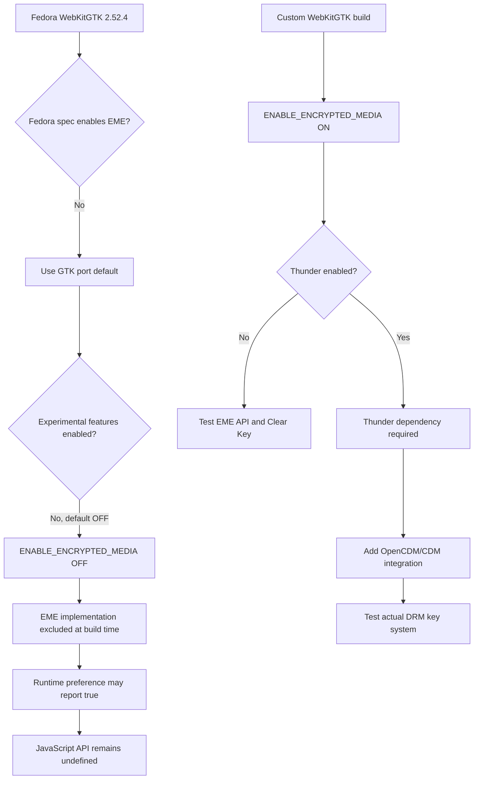

# WebKitGTK EME Investigation

## Status

This document records the Linux-specific investigation into why Resonance does
not expose the Encrypted Media Extensions (EME) API when running in Tauri's
WebKitGTK webview. It supplements the broader protected-playback research in
[`webkit_eme.md`](./webkit_eme.md).

The investigation has identified a compile-time explanation for the current
Fedora/Bazzite result. The next experiment is to build WebKitGTK with EME
explicitly enabled and Thunder explicitly disabled. That experiment has not
yet been performed.

The findings below distinguish among:

- behaviour observed directly in Resonance;
- properties of the installed Linux packages;
- configuration found in Fedora's exact WebKitGTK source package;
- configuration found in the exact WebKitGTK 2.52.4 source tree; and
- conclusions or hypotheses that still require an experimental build.

## Test Environment

The Linux tests were performed on Bazzite 44, an immutable Fedora-based system,
under a Wayland session. Resonance uses Tauri's Linux webview implementation,
which links to the system WebKitGTK library rather than shipping an independent
browser engine.

The installed WebKitGTK binary package reported:

```text
Package: webkit2gtk4.1
Version: 2.52.4-1.fc44
Source RPM: webkitgtk-2.52.4-1.fc44.src.rpm
```

Runtime inspection showed that Resonance links against:

```text
/lib64/libwebkit2gtk-4.1.so.0
```

The relevant webview user agent identified the environment as Linux x86-64
using AppleWebKit 605.1.15 and Safari 605.1.15 compatibility identifiers.

## Runtime Observations

### Wayland and compositing

Starting the Tauri application normally initially failed with a Wayland
protocol error. Resonance could be run by disabling WebKit compositing:

```sh
WEBKIT_DISABLE_COMPOSITING_MODE=1 pnpm --filter @resonance/desktop tauri dev
```

This workaround allows the application to render, but it does not change the
EME result. The Wayland/compositing problem is therefore a separate Linux
runtime issue rather than the cause of the missing JavaScript API.

### Resonance compatibility probe

In both development and packaged Linux builds, the probe reported:

- a secure context;
- a valid development or Tauri origin;
- `navigator.requestMediaKeySystemAccess` as unavailable; and
- no key-system results, because configuration negotiation cannot begin
  without the EME entry point.

The development origin was `http://localhost:1420`. The packaged origin was
`tauri://localhost`.

### Native WebKit setting

Resonance explicitly enabled WebKitGTK's encrypted-media preference from its
Tauri setup code. Reading the preference back reported `true`. Reloading the
webview after setting it did not expose the JavaScript API.

This produced an initially confusing combination:

```text
Native WebKit encrypted-media setting: true
JavaScript requestMediaKeySystemAccess: undefined
```

The source investigation below explains why these results can coexist. The
runtime preference exists and can store an enabled value even when the
underlying EME implementation was omitted from the compiled WebKitGTK binary.

## Host Media Pipeline Inspection

The host GStreamer installation contains common media parsers, demuxers, and
decoders, including support associated with:

- AAC;
- MP4 and QuickTime containers;
- Opus;
- WebM and Matroska; and
- FFmpeg/libav-based decoding.

This establishes that ordinary codec and container support is present. It does
not establish encrypted playback support.

The following search returned no results:

```sh
gst-inspect-1.0 |
  grep -Ei 'widevine|opencdm|thunder|clearkey|decryptor|decrypt'
```

No installed GStreamer element advertised itself as a Widevine, OpenCDM,
Thunder, Clear Key, or generic decryption component. This is consistent with a
system that lacks an external CDM integration path, but it does not by itself
explain why the EME JavaScript API is absent. That absence is explained at the
WebKitGTK compile-time layer.

The Fedora build dependency `pkgconfig(libdrm)` is unrelated to protected media
DRM. Linux `libdrm` provides Direct Rendering Manager interfaces for graphics
and display hardware; it is not a content decryption module.

## Fedora Source-Package Investigation

### Obtaining the exact source

The active Fedora 44 source repositories contained these versions:

```text
webkitgtk-2.52.1-1.fc44.src
webkitgtk-2.52.5-1.fc44.src
```

The installed `2.52.4-1.fc44` build had already been superseded in the active
repository metadata. Its exact historical source RPM was therefore retrieved
from Fedora's Koji package archive:

```text
webkitgtk-2.52.4-1.fc44.src.rpm
```

The downloaded file was approximately 63 MB. RPM verification reported:

```text
digests OK
```

Its metadata confirmed:

```text
Name: webkitgtk
Version: 2.52.4-1.fc44
Source RPM: (none)
```

`Source RPM: (none)` is expected because the inspected package is itself the
source RPM.

### Fedora spec-file result

The source RPM contains `webkitgtk.spec`, the upstream WebKitGTK source archive,
a signature, Fedora's WebKitGTK signing keys, and a small build patch.

Fedora constructs two builds from the source tree: the GTK 4 / WebKitGTK 6.0
variant and the GTK 3 / WebKitGTK 4.1 variant used by the current Tauri
application. The relevant WebKitGTK 4.1 CMake invocation contains:

```spec
%cmake -S .. \
  -GNinja \
  -DPORT=GTK \
  -DCMAKE_BUILD_TYPE=Release \
  -DUSE_GTK4=OFF \
  -DUSE_LIBBACKTRACE=OFF \
  -DENABLE_WEBDRIVER=OFF \
  %{nil}
```

The spec contains no explicit reference to:

- `ENABLE_ENCRYPTED_MEDIA`;
- `ENABLE_EXPERIMENTAL_FEATURES`;
- `ENABLE_THUNDER`;
- Widevine;
- Clear Key;
- OpenCDM; or
- a protected-media decryptor.

Fedora therefore does not explicitly enable EME or Thunder in this build. The
result is determined by WebKitGTK's upstream defaults.

## WebKitGTK 2.52.4 Source Findings

The exact `webkitgtk-2.52.4.tar.xz` source archive from Fedora's source RPM was
extracted and searched.

### Global defaults

`Source/cmake/WebKitFeatures.cmake` defines all three relevant features as off
at the global level:

```cmake
WEBKIT_OPTION_DEFINE(ENABLE_ENCRYPTED_MEDIA "Toggle EME V3 support" PRIVATE OFF)
WEBKIT_OPTION_DEFINE(ENABLE_EXPERIMENTAL_FEATURES "Enable experimental features" PRIVATE OFF)
WEBKIT_OPTION_DEFINE(ENABLE_THUNDER "Toggle EME V3 Thunder support" PRIVATE OFF)
```

The same file exposes experimental features as a normal CMake option whose
default is explicitly off:

```cmake
option(ENABLE_EXPERIMENTAL_FEATURES "Enable experimental features" OFF)
SET_AND_EXPOSE_TO_BUILD(
    ENABLE_EXPERIMENTAL_FEATURES
    ${ENABLE_EXPERIMENTAL_FEATURES}
)
```

### GTK-port defaults

`Source/cmake/OptionsGTK.cmake` makes the GTK port's EME default follow the
experimental-features setting:

```cmake
WEBKIT_OPTION_DEFAULT_PORT_VALUE(
    ENABLE_ENCRYPTED_MEDIA
    PRIVATE
    ${ENABLE_EXPERIMENTAL_FEATURES}
)
```

The GTK port makes Thunder follow WebKit developer mode:

```cmake
WEBKIT_OPTION_DEFAULT_PORT_VALUE(
    ENABLE_THUNDER
    PRIVATE
    ${ENABLE_DEVELOPER_MODE}
)
```

Fedora performs a normal release build and does not enable developer mode,
experimental features, EME, or Thunder in the spec. The resulting values are
therefore expected to be:

```text
ENABLE_EXPERIMENTAL_FEATURES = OFF
ENABLE_ENCRYPTED_MEDIA       = OFF
ENABLE_THUNDER               = OFF
```

### Feature dependencies

WebKit's feature declarations include:

```cmake
WEBKIT_OPTION_DEPEND(ENABLE_ENCRYPTED_MEDIA ENABLE_VIDEO)
WEBKIT_OPTION_DEPEND(ENABLE_THUNDER ENABLE_ENCRYPTED_MEDIA)
```

These relationships mean:

- EME requires WebKit's media/video subsystem; and
- Thunder cannot be enabled unless EME is enabled.

Ordinary media support works in the Fedora WebKitGTK build, so
`ENABLE_VIDEO` is not the observed blocker.

Thunder is only made a required build dependency when both EME and Thunder are
enabled:

```cmake
if (ENABLE_ENCRYPTED_MEDIA AND ENABLE_THUNDER)
    find_package(Thunder REQUIRED)
endif ()
```

This makes it possible to separate the initial EME experiment from the more
complex external-CDM experiment.

## Current Conclusion

The evidence supports the following compile-time explanation:

1. WebKitGTK 2.52.4 defaults `ENABLE_EXPERIMENTAL_FEATURES` to `OFF`.
2. The GTK port assigns that value to the default for
   `ENABLE_ENCRYPTED_MEDIA`.
3. Fedora's 2.52.4 spec does not override either option.
4. Fedora consequently builds WebKitGTK with EME disabled.
5. The compiled library still exposes an encrypted-media preference through
   its native settings API.
6. Resonance can set and read that preference, but the preference cannot
   restore code excluded at compile time.
7. JavaScript therefore receives no `navigator.requestMediaKeySystemAccess`.

This conclusion explains the behaviour observed in both Resonance development
and packaged builds. It is stronger than the earlier hypothesis that an absent
GStreamer plugin alone prevented EME negotiation: the browser-facing feature
itself is disabled before key-system or media-pipeline discovery can begin.

The remaining uncertainty is whether any Fedora build machinery outside the
visible project-specific CMake arguments overrides these values. Nothing in the
exact source package currently indicates such an override, and the observed
runtime behaviour agrees with the default-off result. A controlled build will
provide the final operational confirmation.

## Current Decision Tree



## Next Experiment: Minimal EME Build

The next experiment should alter only the feature under investigation:

```text
-DENABLE_ENCRYPTED_MEDIA=ON
-DENABLE_THUNDER=OFF
```

Enabling all experimental WebKit features would introduce unnecessary build
and runtime variables. Explicitly enabling EME while keeping Thunder disabled
provides a smaller and more interpretable experiment.

### Questions the minimal build should answer

1. Does the build complete without Thunder or an external CDM framework?
2. Does the resulting WebKitGTK library expose
   `navigator.requestMediaKeySystemAccess` to Resonance?
3. Does Resonance's probe recognize the W3C Clear Key control configuration?
4. Can the runtime create `MediaKeys` and a temporary `MediaKeySession`?
5. Which additional runtime components, if any, are required before Clear Key
   configuration negotiation succeeds?

### What success would establish

If the minimal build exposes EME and accepts Clear Key, it would confirm that:

- Fedora's compile-time default caused the missing API;
- WebKitGTK's EME implementation can function on the test system;
- Resonance can reach that implementation through Tauri; and
- a custom WebKitGTK distribution is technically relevant to the project.

It would not establish Widevine support. Widevine would still require a usable
CDM, a WebKitGTK integration path such as Thunder/OpenCDM, compatible media
pipeline components, and provider authorization.

### Follow-up build path

Only after the minimal EME build succeeds should the investigation attempt:

```text
-DENABLE_ENCRYPTED_MEDIA=ON
-DENABLE_THUNDER=ON
```

That second path adds the Thunder build dependency and begins the separate
investigation into OpenCDM and proprietary CDM integration.

## Evidence Still Worth Capturing

The following evidence would strengthen or extend this investigation:

- the final CMake configuration summary or `CMakeCache.txt` from Fedora's
  original 2.52.4 build, if available;
- the CMake summary and cache from the custom minimal build;
- a comparison between Fedora's 2.52.4 and 2.52.5 specs;
- exported symbol or generated-feature inspection of the two built libraries;
- Resonance probe output using the custom library;
- a Clear Key session-creation test; and
- an inventory of Thunder/OpenCDM packages and compatible CDM adapters.

